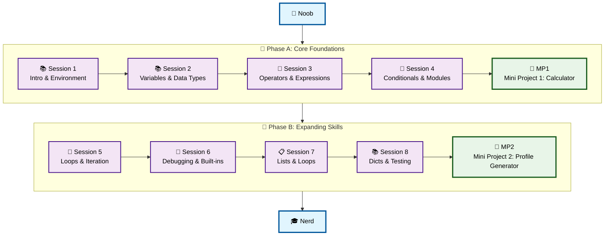

# 🐍 Level 1: Noob → Nerd - Python Fundamentals

## From clueless to curious: Your first exposure to Python programming

> 1. **Level:** Noob → Nerd *(first exposure, installing Python, printing output)*
> 1. **Format:** 2 phases × (4 sessions + 1 mini project) = 10 sessions total
> 1. **Outcome:** 2 Mini Projects to cement your foundation  
> 1. **Total Duration:** ~6–7 hours (10 × 30–45 min)

## Powered by ShyvnTech & Swamy's Tech Skills Academy

> **Transformation Focus**: This isn't just about learning Python syntax - it's about evolving your mindset from complete beginner to someone genuinely curious about programming. Each session builds confidence and practical skills.

---

## 🎯 **Level 1 Learning Path (Noob → Nerd)**

| Phase | Session | Topic                                                 | Duration  | Type         | Status         |
| ----- | ------- | ----------------------------------------------------- | --------- | ------------ | -------------- |
| A     | 1       | Python Introduction, Environment & Built-in Functions | 30 min    | 📚 Knowledge | ✅ Ready 📂     |
| A     | 2       | Variables & Data Types                                | 30 min    | 📚 Knowledge | 🚧 In Progress |
| A     | 3       | Operators & Expressions                               | 30 min    | 📚 Knowledge | 🔄 Coming Soon |
| A     | 4       | Conditionals, Indentation & Introduction to Modules   | 30 min    | 📚 Knowledge | 🔄 Coming Soon |
| A     | 🚀 MP1  | Mini Project 1: Simple Calculator *(after Session 4)* | 30–45 min | 🛠️ Project  | 🔄 Coming Soon |
| B     | 5       | Loops & Iteration                                     | 30 min    | 📚 Knowledge | 🔄 Coming Soon |
| B     | 6       | Basic Debugging, Reading Errors & Built-in Functions  | 30 min    | 📚 Knowledge | 🔄 Coming Soon |
| B     | 7       | Lists & Loops                                         | 30 min    | 📚 Knowledge | 🔄 Coming Soon |
| B     | 8       | Dictionaries & Basic Testing                          | 30 min    | 📚 Knowledge | 🔄 Coming Soon |
| B     | 🚀 MP2  | Mini Project 2: Personal Profile Generator *(after 8)*| 30–45 min | 🛠️ Project  | 🔄 Coming Soon |

---

## 🗺️ **Visual Roadmap**

---

## 📅 **Session-by-Session Breakdown**

## 📅 **Phase A: Core Foundations + Mini Project 1**

### ✅ Session 1: Python Introduction & Environment Setup

* What is Python? History, usage, job market
* Installing Python 3.13+ and VS Code
* Understanding Python execution (PVM explanation)
* Python Interactive Shell (REPL) exploration
* Built-in functions: `print()`, `input()`, `type()`, `help()`, f-strings
* Your first scripts: From "Hello World" to interaction
* Introduction to comments

🧪 *Practice Files*:  
`src/L1/S1/01_hello.py`, `src/L1/S1/02_interactive_hello.py`, `src/L1/S1/bytecode_demo.py`

---

### 🔄 Session 2: Variables & Data Types

* Variable naming conventions and assignment
* Data types: `int`, `float`, `str`, `bool`
* Dynamic typing, `type()`, `isinstance()`
* Type conversion and casting

🧪 *Mini Practice*: Store and display personal details with different data types.  
📌 *Feeds into Mini Project 1*: User input and storage are core to the calculator.

---

### 🔄 Session 3: Operators & Expressions

* Arithmetic operators: `+`, `-`, `*`, `/`, `//`, `%`, `**`
* Comparison operators: `==`, `!=`, `<`, `>`, `<=`, `>=`
* Assignment operators: `=`, `+=`, `-=`, etc.
* Operator precedence and parentheses

🧪 *Mini Practice*: Build a basic calculator with different operations.  
📌 *Feeds into Mini Project 1*: Calculator logic.

---

### 🔄 Session 4: Conditional Statements, Indentation & Modules

* Python indentation rules (why no braces)
* `if`, `elif`, `else` statements
* Boolean logic: `and`, `or`, `not`
* Built-in functions vs modules
* Importing modules (`import`, `from...import`)
* `random` module: random numbers, choices, shuffling

🧪 *Mini Practice*: Build a number guessing game using conditionals + `random`.  
📌 *Feeds into Mini Project 1*: Conditional checks & input handling.

---

### 🚀 Mini Project 1: Simple Calculator

**Goal:** Build a command-line calculator for basic arithmetic.

**Features:**

* Addition, subtraction, multiplication, division
* User-friendly input handling
* Input validation
* Runs until user quits
* Clean, structured code

🧪 *Deliverable*: `simple_calculator.py`

🎯 *Stretch Goals*:

* Add power (`**`) and square root
* Add a memory function to store last result

---

## 📅 **Phase B: Expanding Skills + Mini Project 2**

### 🔄 Session 5: Loops & Iteration

* `for` loops with `range()` and iterables
* `while` loops and loop conditions
* Loop controls: `break`, `continue`, `pass`
* Nested loops and performance considerations

🧪 *Mini Practice*: FizzBuzz challenge, countdown timer, pattern printing.  
📌 *Feeds into Mini Project 2*: Looping over profiles.

---

### 🔄 Session 6: Basic Debugging & Built-in Functions

* Error types: syntax vs runtime
* Reading error messages
* Common beginner mistakes
* Debugging with `print()`
* Built-in functions: `len()`, `max()`, `min()`, `sum()`, `type()`

🧪 *Mini Practice*: Debug broken code samples.  
📌 *Feeds into Mini Project 2*: Debugging profile input.

---

### 🔄 Session 7: Lists & Loops

* List creation, indexing, slicing, basic methods
* Operations: `append()`, `remove()`, `len()`, accessing elements
* Iteration with lists
* Practical list usage: filtering, modifying, building from user input

🧪 *Mini Practice*: Task list manager with lists + loops.  
📌 *Feeds into Mini Project 2*: Storing multiple hobbies or goals.

---

### 🔄 Session 8: Dictionaries & Basic Testing

* Dictionaries: creation, update, deletion
* Methods: `.keys()`, `.values()`, `.items()`, `.get()`
* Iterating over dictionaries
* Why testing matters
* Manual testing vs using `assert`

🧪 *Mini Practice*: Student gradebook with dictionaries + asserts.  
📌 *Feeds into Mini Project 2*: User profiles as dictionaries + validation.

---

### 🚀 Mini Project 2: Personal Profile Generator

**Goal:** Create an interactive profile generator and display system.

**Features:**

* Collect user info (name, age, hobbies, goals)
* Store in dictionaries + lists
* Display formatted profile
* Handle multiple profiles
* Basic input validation

🧪 *Deliverable*: `profile_generator.py`

🎯 *Stretch Goals*:

* Export profile to JSON file
* Allow search/filter by name
* Add “edit profile” option

---

## 🎓 **Level 1 Learning Outcomes**

By completing Level 1, you will:

* ✅ Set up Python environment confidently
* ✅ Write & run first Python scripts
* ✅ Use built-in functions effectively
* ✅ Work with variables, operators, and conditionals
* ✅ Control program flow with loops
* ✅ Debug errors using messages and print statements
* ✅ Store/manipulate data using lists & dictionaries
* ✅ Apply basic testing with asserts
* ✅ Complete 2 mini projects showing your skills
* ✅ Be ready for **Level 2: Nerd → Novice**

---

## 📊 **Assessment Criteria**

* **Phase A**: Can install Python, work with variables, operators, and conditionals → Complete Calculator Project
* **Phase B**: Can debug, work with loops, lists, and dictionaries → Complete Profile Generator Project

**Mini Project Success Indicators:**

* Calculator works with all four operations, validates input, runs continuously.
* Profile generator collects + displays user data, supports multiple profiles, validates inputs.

---

## 🎓 **Next Steps & Resources**

After Level 1, you’re ready to explore:

* Functions & modular programming
* File handling
* Error handling (exceptions)
* Advanced data structures

**Tools Recommended:**

* Python 3.13+
* VS Code with Python extension
* Git for version control
* (Optional) Jupyter Notebook, PyCharm, Replit

---

✨ Happy Coding! 🐍
