# Session 1: Python Introduction & Environment Setup

**Duration:** 30 minutes  
**Type:** 📚 Knowledge  
**Level:** Noob → Nerd

---

## 🎯 **Session Overview & Agenda**

### **What You'll Learn:**

- ✅ Set up Python development environment (Python + VS Code)
- ✅ Understand what Python is and why it's popular
- ✅ Learn how Python works behind the scenes (PVM explanation)
- ✅ Introduction to the Python Interactive Shell (REPL)
- ✅ Write and run your first Python scripts
- ✅ Understand Python comments and their importance
- ✅ Use built-in functions: print(), input(), type(), and help() for basic operations
- ✅ Learn f-string formatting for dynamic text output

### **Session Flow:**

| Part | Activity                        | Description                                                                                |
| ---- | ------------------------------- | ------------------------------------------------------------------------------------------ |
| 1    | Environment Setup               | Install Python & VS Code                                                                   |
| 2    | What is Python & Why?           | Introduction to Python and its popularity                                                  |
| 3    | How Python Really Works         | The magic behind the scenes - compilation & interpretation                                 |
| 4    | Python Interactive Shell (REPL) | Explore Python directly - immediate feedback and experimentation                           |
| 5    | Hands-on Practice (3 files)     | `01_hello.py`, `02_interactive_hello.py`, `bytecode_demo.py` - Building your first scripts |

---

## 📋 **Before You Begin**

### **Prerequisites:**

✅ Computer with internet access  
✅ Administrator privileges (for software installation)  
✅ 30 minutes of focused time  
❌ No prior programming experience required

---

## 💻 **Part 1: Environment Setup**

### **Step 1: Install Python**

#### **Windows (Windows 10/11):**

1. Go to [python.org](https://python.org)
2. Download Python 3.13+ (latest stable version)
3. **IMPORTANT:** Check "Add Python to PATH" during installation
4. Verify installation:

```powershell
python --version
```

#### **Mac:**

```bash
# Using Homebrew (recommended)
brew install python

# Or download from python.org
```

#### **Linux (Ubuntu/Debian):**

```bash
sudo apt update
sudo apt install python3 python3-pip
```

### **Step 2: Install VS Code**

1. Download from [code.visualstudio.com](https://code.visualstudio.com)
2. Install the **Python extension**:
   - Open VS Code
   - Go to Extensions (Ctrl+Shift+X)
   - Search "Python" by Microsoft
   - Install it

### **Verification Check:**

**Windows (PowerShell):**

```powershell
# Terminal commands to verify
python --version          # Should show Python 3.13+
py -0p                    # Should list installed Python versions
pip --version             # Should show pip version
code --version            # Should show VS Code version
```

**Mac/Linux (Terminal):**

```bash
# Terminal commands to verify
python3 --version         # Should show Python 3.13+
pip3 --version            # Should show pip version
code --version            # Should show VS Code version
```

**Expected Output (Example):**

```text
PS C:\Users\YourName> python --version
Python 3.13.5

PS C:\Users\YourName> pip --version
pip 25.1.1 from C:\Users\YourName\AppData\Local\Programs\Python\Python313\Lib\site-packages\pip (python 3.13)

PS C:\Users\YourName> code --version
1.102.1
```

### ✅ **Progress Check: Environment Setup**

Before moving to the next section, ensure you can:

- [ ] Successfully run `python --version` and see Python 3.13+
- [ ] Open VS Code and see the Python extension installed
- [ ] Create a new `.py` file and see Python syntax highlighting

---

## 🐍 **Part 2: What is Python & Why?**

### **What is Python?**

Python is a **powerful, popular, and versatile programming language** created by Guido van Rossum in 1991.

**Why Python is Popular:**

- **Easy syntax** - Simple to learn and read
- **Beginner-friendly** - Easier than other programming languages
- **Versatile** - Used across many different industries
- **Powerful** - Can build everything from websites to AI systems

### **Why Choose Python?**

```text
✅ Beginner-friendly syntax
✅ Huge community and libraries
✅ High demand in job market
✅ Cross-platform (Windows, Mac, Linux)
✅ Free and open-source
```

### **Python in the Real World**

**🌐 Web Development:** Django & Flask frameworks (Instagram, YouTube, Dropbox)  
**📊 Data Science & Analytics:** Financial analysis, pharmaceuticals, predictive modeling  
**🔬 Scientific Computing:** Physics, astronomy, biology research  
**🤖 AI & Machine Learning:** Tesla, Netflix recommendations  
**🖥️ Desktop Applications:** GUI apps, game development, network servers  
**📚 Education:** Teaching programming in schools and universities  
**💰 Quantitative Finance:** Trading algorithms, risk management systems

---

## 🔍 **Part 3: How Python Really Works**

### **The Magic Behind the Scenes**

Python is often called an "interpreted language," but it's actually **both compiled AND interpreted**! Here's what happens when you run a Python script:

## 🔄 **Python Execution Flow (How Code Becomes Action)**

1. **You write code** — say in `app.py`:

   ```python
   print("Hello, World!")
   ```

2. **Python compiler** checks your code and converts it into **bytecode** (a low-level, platform-independent instruction set).

3. That **bytecode** is sent to the **Python Virtual Machine (PVM)**.

4. The **PVM interprets bytecode** line-by-line, translating it into actual machine-level instructions for your computer's processor.

5. ✨ **Output happens** — your message prints, logic executes, files save, etc.

### **Visual Representation:**

```mermaid
graph TD
    A["📄 app.py<br/>(Your Source Code)"] --> B["🔧 Python Compiler<br/>(Checks syntax & errors)"]
    B --> C["💾 Bytecode<br/>(Platform-independent<br/>representation)"]
    C --> D["🚀 Python Virtual Machine<br/>(Interpreter)"]
    D --> E["✨ Results<br/>(Hello, World!)"]

    style A fill:#e1f5fe
    style B fill:#fff3e0
    style C fill:#f3e5f5
    style D fill:#e8f5e8
    style E fill:#fff8e1
```



### **Alternative Visual Representation:**

```text
📄 app.py (Your Source Code)
       ↓
🔧 Python Compiler
       ↓
💾 Bytecode (Platform-independent representation)
       ↓
🚀 Python Virtual Machine (PVM)
       ↓
✨ Results (Hello, World!)
```

## 🐍 **The Python Virtual Machine (PVM) - The Real Star**

The **Python Virtual Machine (PVM)** is the final layer in Python's execution process — it's the part that _actually runs your code_. Think of it like Python's behind-the-scenes actor that performs the script you've written!

## 🎯 **Why Is the PVM Important?**

- 🔄 **Makes Python cross-platform:** your bytecode can run on Windows, Mac, Linux
- 🧠 **Enables Python's flexibility:** dynamic typing, memory management, etc.
- 🔍 **Gives Python its interpreted nature** — unlike compiled languages that generate native binaries

## 📚 **Analogy:**

Imagine Python as a **playwright**, bytecode as the **script**, and PVM as the **actor** performing the play. You don't watch the playwright or read the script — you see the actor bring it to life.

**💡 Key Point:** This all happens automatically in the background - you just write code and run it!

### **Why This Matters:**

- **Fast execution** - Bytecode runs efficiently
- **Cross-platform** - Same code works on Windows, Mac, Linux
- **Error checking** - Compiler catches mistakes before running
- **Easy to use** - You don't need to worry about the complexity!

### ✅ **Progress Check: Understanding Python**

Before moving to hands-on practice, ensure you understand:

- [ ] Python compiles your code to bytecode first
- [ ] The Python Virtual Machine (PVM) interprets the bytecode
- [ ] This process makes Python cross-platform
- [ ] The playwright/script/actor analogy makes sense to you

---

## 💬 **Part 4: Python Interactive Shell (REPL)**

### **What is the Python Interactive Shell?**

The **Python Interactive Shell** (also called **REPL** - Read-Eval-Print-Loop) lets you type Python code directly and see results immediately! It's like having a conversation with Python.

> 1. Read your input (Python code)
> 1. Evaluate it (run the code)
> 1. Print the result
> 1. Loop back to wait for the next input

It’s like having a live conversation with Python—type something in, and it immediately responds.

### **Starting the Interactive Shell:**

**Windows (PowerShell):**

```powershell
# Start Python interactive shell
python
```

**Mac/Linux (Terminal):**

```bash
# Start Python interactive shell
python3
```

**You'll see something like:**

```text
Python 3.13.5 (tags/v3.13.5, Jun 11 2025, 16:15:46) [MSC v.1943 64 bit (AMD64)] on win32
Type "help", "copyright", "credits" or "license" for more information.
>>>
```

### **🚀 Let's Explore Python Live!**

Try these commands in the interactive shell (type each line and press Enter):

#### **Simple Math:**

```python
>>> 5 + 3
8

>>> 10 * 4
40

>>> 100 / 3
33.333333333333336
```

#### **Basic Output:**

```python
>>> print("Hello, Python!")
Hello, Python!

>>> print("I'm learning Python interactively!")
I'm learning Python interactively!
```

#### **Working with Text:**

```python
>>> name = "Python"
>>> print(f"I love {name}!")
I love Python!

>>> message = "Python is awesome"
>>> message
'Python is awesome'
```

#### **Understanding User Input (Important!):**

```python
>>> # All input from users comes in as strings
>>> name = input("What's your name? ")
What's your name? Alice
>>> type(name)
<class 'str'>

>>> age = input("How old are you? ")
How old are you? 25
>>> type(age)
<class 'str'>

>>> # Notice: Even numbers become strings!
>>> print(f"Hello {name}, you are {age} years old!")
Hello Alice, you are 25 years old!
```

### **💡 Interactive Shell Benefits:**

- ✅ **Instant feedback** - See results immediately
- ✅ **Easy experimentation** - Try ideas quickly
- ✅ **No files needed** - Just type and go
- ✅ **Perfect for learning** - Test concepts as you learn them
- ✅ **Built-in help** - Type `help()` for assistance

### **🆘 Getting Help in Python**

Python has excellent built-in help! Try these commands in the interactive shell:

#### **General Help:**

```python
>>> help()
```


#### **Help for Specific Functions:**

```python
>>> help(print)
```


**💡 Pro Tip:** The `help()` function is your best friend when learning Python. Use it to explore any function, method, or object!

### **💬 Exiting the Shell:**

```python
>>> exit()
# Or press Ctrl+C (Windows/Linux) or Cmd+C (Mac)
```

### ✅ **Progress Check: Interactive Shell**

Before moving to file-based coding, ensure you can:

- [ ] Start the Python interactive shell successfully
- [ ] Execute basic print statements and see output
- [ ] Perform simple calculations
- [ ] Create variables and use f-strings
- [ ] Exit the shell cleanly

---

## 🚀 **Part 5: Hands-on Practice (File-Based Coding)**

### **📁 Complete File Reference:**

**File Location:** `[your-project-folder]\src\L1\S1\` _(replace with your actual path)_  
**Practice Files:** `01_hello.py`, `02_interactive_hello.py`, `bytecode_demo.py`

1. **`01_hello.py`** 🎯 **Learn:** Basic output, comments, syntax
2. **`02_interactive_hello.py`** 🎯 **Learn:** User input, f-strings, variables
3. **`bytecode_demo.py`** 🎯 **Learn:** Python's internal workings, bytecode compilation

### **Complete Project Structure**

```text
📁 pyfundamentals/
└── 📁 src/
    └── 📁 L1/
        └── 📁 S1/
            ├── 📄 01_hello.py
            ├── 📄 02_interactive_hello.py
            └── 📄 bytecode_demo.py
```

### **💡 Built-in Functions in Python**

Python comes with many **built-in functions** ready to use without importing anything. In this session, we'll use four essential ones:

- **`print()`** - Displays output to the screen
- **`input()`** - Gets input from the user
- **`type()`** - Shows what type of data you're working with
- **`help()`** - Provides help and documentation for Python objects (see the help images above!)

These functions are always available and form the foundation of Python programming!

### **Script 1: 01_hello.py (Basic Output)**

```python
# Filename: src/L1/S1/01_hello.py

print("Hello, World!")
print("Welcome to Python Fundamentals!")
print("This is Session 1")

# This is a single-line comment
print("\n💬 Comments help explain code")

"""
This is a multi-line comment. We'll learn more about these in future sessions.
"""
print("\n💬 Multi-line comments are useful for longer explanations")
```

### **Running the Script**

#### **Method 1: VS Code (Recommended)**

1. Open `01_hello.py` in VS Code
2. Click ▶️ "Run Python File" button
3. OR press `Ctrl+F5`

#### **Method 2: Terminal**

**Windows (PowerShell):**

```powershell
# Navigate to your project folder
cd [your-project-folder]\src\L1\S1

# Run the script
python 01_hello.py
```

**Mac/Linux (Terminal):**

```bash
# Navigate to your project folder
cd [your-project-folder]/src/L1/S1

# Run the script
python3 01_hello.py
```

### **Expected Output:**

```text
Hello, World!
Welcome to Python Fundamentals!
This is Session 1

💬 Comments help explain code

💬 Multi-line comments are useful for longer explanations
```

### **Script 2: 02_interactive_hello.py (User Input)**

```python
# Filename: src/L1/S1/02_interactive_hello.py

# Interactive greeting script
print("=== Python Interactive Greeting ===")

# Get user input
name = input("What's your name? ")
age = input("How old are you? ")

# Display personalized message
print(f"Hello, {name}!")
print(f"You are {age} years old.")
print("Nice to meet you!")

# Demonstrate built-in functions type() and help()
print("\n🔍 Let's explore Python's built-in functions:")
print(f"The name '{name}' is of type: {type(name)}")
print(f"The age '{age}' is of type: {type(age)}")

print("\n💡 Want to learn more about a function? Try help()!")
print("For example: help(print) shows documentation for print function")
print("(You can try this in the Python shell later!)")
```

---

## 🎬 **Script 3: bytecode_demo.py (Advanced Python Preview)**

This script demonstrates Python's internal workings and shows the bytecode compilation process we learned about:

```python
# Filename: src/L1/S1/bytecode_demo.py

# Session 1 - Advanced Example (Preview of what you'll learn)
# This shows what you can build after completing the course!

import dis
print("🚀 Advanced Python Preview")
print("=" * 50)

# Demonstrate Python's compilation process (from our lesson!)
print("\n🔍 Python Magic: Compilation & Interpretation Demo")
print("Let's see Python's bytecode in action!")


def greet():
    print("Hello World")


print("\n📄 Your Python Code:")
print("def greet():")
print("    print('Hello World')")

print("\n💾 Python's Bytecode (what the compiler creates):")
dis.dis(greet)

print("\n🎯 Cool, right? Python converted your code into bytecode!")
print("This is exactly what we learned about: Compilation → Bytecode → Interpretation")

print("\n" + "=" * 50)
print("🚀 Amazing! You've just seen Python's internal magic!")
print("This bytecode runs on the Python Virtual Machine.")
print("Keep learning, and you'll discover even more Python secrets! 🐍✨")
```

---

## 📝 **Key Takeaways**

### **What We Learned:**

- ✅ Setting up Python development environment (Python + VS Code)
- ✅ Python is a powerful, beginner-friendly language
- ✅ Understanding how Python compilation and interpretation works
- ✅ Creating and running Python scripts
- ✅ Using built-in functions: `print()` for output, `input()` for user interaction, `type()` for data type checking, and `help()` for documentation
- ✅ Basic string formatting with f-strings

### **Python Concepts Introduced:**

- **Comments:** `# This is a comment`
- **Built-in Functions:**
  - **`print()`:** Output function for displaying text
  - **`input()`:** Input function for getting user data
  - **`type()`:** Function to check data types
  - **`help()`:** Function to get documentation and help
- **Variables:** `name = "John"`
- **F-strings:** `f"Hello, {name}"`

---

## 🔧 **Troubleshooting**

### **Common Issues:**

#### **"Python not found" error:**

**Windows (PowerShell):**

```powershell
# Check if Python is in PATH
$env:PATH

# Reinstall Python with "Add to PATH" checked
```

**Mac/Linux (Terminal):**

```bash
# Check if Python is in PATH
echo $PATH

# Reinstall Python with "Add to PATH" checked
```

#### **VS Code not recognizing Python:**

1. Open Command Palette (`Ctrl+Shift+P`)
2. Type "Python: Select Interpreter"
3. Choose your Python installation

#### **Script not running:**

- Check file extension is `.py`
- Ensure you're in the correct directory
- Try running with `python3` instead of `python`

---

**🎉 Congratulations! You've completed Session 1!**  
_You're now ready to dive deeper into Python fundamentals._
