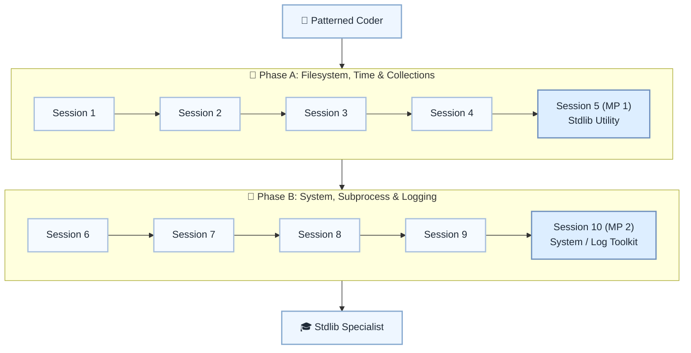

# 🧰 Level 10: Patterned Coder → Stdlib Specialist — Standard Library Mastery

## Master core Python stdlib modules for everyday problems

> **Stage:** Part 2 — Professional Python Development (Levels 7–12) · **Program:** [Python Software Engineering Journey](../../01_Python-Fundamentals-MasterPlan.md)
>
> 1. **Level:** Patterned Coder → Stdlib Specialist
> 1. **Format:** 2 phases × (4 sessions + 1 mini project) = 10 sessions total
> 1. **Outcome:** 2 Mini Projects powered by stdlib file, datetime, collections, logging, and regex tools
> 1. **Core guided time:** ~5 hours core guided instruction (+ MPs)

## Powered by ShyvnTech & Swamy's Tech Skills Academy

> **Transformation Focus:** Reach for built-in modules before reinventing common solutions.

### Level 10 status (three axes)

| Axis | Status |
| --- | --- |
| **Curriculum** | Draft — level plan aligned to master plan; session docs pending |
| **Delivery** | Not started (meetup schedule TBD) |
| **Repository** | Planned — `_Plan.md` scaffold; session docs and practice code pending |

---

## 🎯 **Level 10 Learning Path (Patterned Coder → Stdlib Specialist)**

| Phase | Session | Topic | Duration | Type | Curriculum | Delivery |
| ----- | ------- | ----- | -------- | ---- | ---------- | -------- |
| A | 1 | Filesystem Essentials with os and pathlib | 30 min | 📚 Knowledge | Draft | Pending |
| A | 2 | Dates & Times with datetime and time | 30 min | 📚 Knowledge | Draft | Pending |
| A | 3 | Smart Collections: collections (Counter, defaultdict, etc.) | 30 min | 📚 Knowledge | Draft | Pending |
| A | 4 | Efficient Iteration with itertools | 30 min | 📚 Knowledge | Draft | Pending |
| A | 5 (MP 1) | Mini Project 1: File & Data Utility Powered by Stdlib *(after Session 4)* | 30 min | 🛠️ Project | Draft | Pending |
| B | 6 | System & Environment Info with sys and platform | 30 min | 📚 Knowledge | Draft | Pending |
| B | 7 | Running Other Programs Safely with subprocess | 30 min | 📚 Knowledge | Draft | Pending |
| B | 8 | Structured Logging with logging | 30 min | 📚 Knowledge | Draft | Pending |
| B | 9 | Text & Pattern Matching with re (Regex Intro) | 30 min | 📚 Knowledge | Draft | Pending |
| B | 10 (MP 2) | Mini Project 2: Stdlib-Powered System / Log Toolkit *(after Session 9)* | 30 min | 🛠️ Project | Draft | Pending |

---

## 🗺️ **Visual Roadmap**

---

## 📅 **Phase A: Phase A: Filesystem, Time & Collections**

### ✅ Session 1: Filesystem Essentials with os and pathlib *(Draft · delivery: Pending)*

* Core concepts for Filesystem Essentials with os and pathlib (see master plan).

🧪 *Practice / deliverable*: `src/L10/S1/` — planned  
📖 *Documentation*: planned `docs/sessions/L10/S1.md`

---

### ✅ Session 2: Dates & Times with datetime and time *(Draft · delivery: Pending)*

* Core concepts for Dates & Times with datetime and time (see master plan).

🧪 *Practice / deliverable*: `src/L10/S2/` — planned  
📖 *Documentation*: planned `docs/sessions/L10/S2.md`

---

### ✅ Session 3: Smart Collections: collections (Counter, defaultdict, etc.) *(Draft · delivery: Pending)*

* Core concepts for Smart Collections: collections (Counter, defaultdict, etc.) (see master plan).

🧪 *Practice / deliverable*: `src/L10/S3/` — planned  
📖 *Documentation*: planned `docs/sessions/L10/S3.md`

---

### ✅ Session 4: Efficient Iteration with itertools *(Draft · delivery: Pending)*

* Core concepts for Efficient Iteration with itertools (see master plan).

🧪 *Practice / deliverable*: `src/L10/S4/` — planned  
📖 *Documentation*: planned `docs/sessions/L10/S4.md`

---

### 🚀 Mini Project 5 (MP 1): File & Data Utility Powered by Stdlib *(Draft · delivery: Pending)*

* Deliverable aligned to Mini Project 1: File & Data Utility Powered by Stdlib (see master plan).

🧪 *Practice / deliverable*: `src/L10/S5/` — planned  
📖 *Documentation*: planned `docs/sessions/L10/S5 (MP 1).md`

---

## 📅 **Phase B: Phase B: System, Subprocess & Logging**

### ✅ Session 6: System & Environment Info with sys and platform *(Draft · delivery: Pending)*

* Core concepts for System & Environment Info with sys and platform (see master plan).

🧪 *Practice / deliverable*: `src/L10/S6/` — planned  
📖 *Documentation*: planned `docs/sessions/L10/S6.md`

---

### ✅ Session 7: Running Other Programs Safely with subprocess *(Draft · delivery: Pending)*

* Core concepts for Running Other Programs Safely with subprocess (see master plan).

🧪 *Practice / deliverable*: `src/L10/S7/` — planned  
📖 *Documentation*: planned `docs/sessions/L10/S7.md`

---

### ✅ Session 8: Structured Logging with logging *(Draft · delivery: Pending)*

* Core concepts for Structured Logging with logging (see master plan).

🧪 *Practice / deliverable*: `src/L10/S8/` — planned  
📖 *Documentation*: planned `docs/sessions/L10/S8.md`

---

### ✅ Session 9: Text & Pattern Matching with re (Regex Intro) *(Draft · delivery: Pending)*

* Core concepts for Text & Pattern Matching with re (Regex Intro) (see master plan).

🧪 *Practice / deliverable*: `src/L10/S9/` — planned  
📖 *Documentation*: planned `docs/sessions/L10/S9.md`

---

### 🚀 Mini Project 10 (MP 2): Stdlib-Powered System / Log Toolkit *(Draft · delivery: Pending)*

* Deliverable aligned to Mini Project 2: Stdlib-Powered System / Log Toolkit (see master plan).

🧪 *Practice / deliverable*: `src/L10/S10/` — planned  
📖 *Documentation*: planned `docs/sessions/L10/S10 (MP 2).md`

---

## 🎓 **Level 10 Learning Outcomes**

* Complete Level 10 session outcomes and both mini projects
* Apply concepts from the master plan with original examples
* Be ready for Level 11

### Exit criteria (before next level)

* Use pathlib cross-platform
* Use datetime for parse/format/arithmetic
* Use Counter or defaultdict to simplify processing
* Explain stdlib vs custom code trade-offs

### Reflection (Level 10)

* What surprised me at this level?
* What was hardest — and what habit will I keep?
* What would I redesign in my mini project?
* What could I explain to a peer in five minutes?
* What one ADR would I write for MP1 or MP2?

---

## 📊 **Assessment Criteria**

* **Phase A:** os/pathlib/datetime/collections → MP1 utility
* **Phase B:** subprocess/logging/re → MP2 toolkit

---

## 🎓 **Next Steps & Resources**

* Third-party ecosystem (Level 11)

✨ Happy Coding! 🐍
