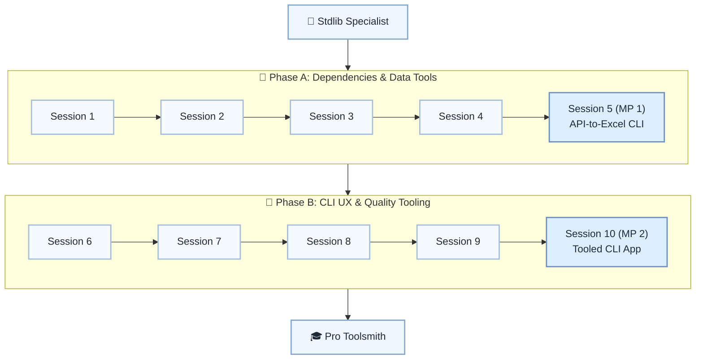

# 🔌 Level 11: Stdlib Specialist → Pro Toolsmith — Third-Party Ecosystem

## Use curated third-party libraries like a professional Python developer

> **Stage:** Part 2 — Professional Python Development (Levels 7–12) · **Program:** [Python Software Engineering Journey](../../01_Python-Fundamentals-MasterPlan.md)
>
> 1. **Level:** Stdlib Specialist → Pro Toolsmith
> 1. **Format:** 2 phases × (4 sessions + 1 mini project) = 10 sessions total
> 1. **Outcome:** 2 Mini Projects: API-to-Excel CLI and fully tooled CLI app
> 1. **Core guided time:** ~5 hours core guided instruction (+ MPs)

## Powered by ShyvnTech & Swamy's Tech Skills Academy

> **Transformation Focus:** Integrate requests, openpyxl, click, rich, pytest, and config tools in clean repos.

### Level 11 status (three axes)

| Axis | Status |
| --- | --- |
| **Curriculum** | Draft — level plan aligned to master plan; session docs pending |
| **Delivery** | Not started (meetup schedule TBD) |
| **Repository** | Planned — `_Plan.md` scaffold; session docs and practice code pending |

---

## 🎯 **Level 11 Learning Path (Stdlib Specialist → Pro Toolsmith)**

| Phase | Session | Topic | Duration | Type | Curriculum | Delivery |
| ----- | ------- | ----- | -------- | ---- | ---------- | -------- |
| A | 1 | Third-Party Libraries 101: pip, venvs & Choosing Dependencies | 30 min | 📚 Knowledge | Draft | Pending |
| A | 2 | HTTP & JSON APIs with requests (GET + Params + JSON) | 30 min | 📚 Knowledge | Draft | Pending |
| A | 3 | Working with Excel & Tabular Data using openpyxl | 30 min | 📚 Knowledge | Draft | Pending |
| A | 4 | Configuration & Secrets: .env, configparser, Basic Validation | 30 min | 📚 Knowledge | Draft | Pending |
| A | 5 (MP 1) | Mini Project 1: API-to-Excel Reporter CLI *(after Session 4)* | 30–45 min | 🛠️ Project | Draft | Pending |
| B | 6 | Building Polished CLIs with click | 30 min | 📚 Knowledge | Draft | Pending |
| B | 7 | Better Terminal UX with rich and Progress with tqdm | 30 min | 📚 Knowledge | Draft | Pending |
| B | 8 | Everyday Testing with pytest (Basics & Parametrized Tests) | 30 min | 📚 Knowledge | Draft | Pending |
| B | 9 | Formatting & Linting in Practice (black, isort, flake8 Intro) | 30 min | 📚 Knowledge | Draft | Pending |
| B | 10 (MP 2) | Mini Project 2: Fully Tooled CLI App in a Clean Repo *(after Session 9)* | 30–45 min | 🛠️ Project | Draft | Pending |

---

## 🗺️ **Visual Roadmap**

---

## 📅 **Phase A: Phase A: Dependencies & Data Tools**

### ✅ Session 1: Third-Party Libraries 101: pip, venvs & Choosing Dependencies *(Draft · delivery: Pending)*

* Core concepts for Third-Party Libraries 101: pip, venvs & Choosing Dependencies (see master plan).

🧪 *Practice / deliverable*: `src/L11/S1/` — planned  
📖 *Documentation*: planned [S1.md](S1.md)

---

### ✅ Session 2: HTTP & JSON APIs with requests (GET + Params + JSON) *(Draft · delivery: Pending)*

* Core concepts for HTTP & JSON APIs with requests (GET + Params + JSON) (see master plan).

🧪 *Practice / deliverable*: `src/L11/S2/` — planned  
📖 *Documentation*: planned [S2.md](S2.md)

---

### ✅ Session 3: Working with Excel & Tabular Data using openpyxl *(Draft · delivery: Pending)*

* Core concepts for Working with Excel & Tabular Data using openpyxl (see master plan).

🧪 *Practice / deliverable*: `src/L11/S3/` — planned  
📖 *Documentation*: planned [S3.md](S3.md)

---

### ✅ Session 4: Configuration & Secrets: .env, configparser, Basic Validation *(Draft · delivery: Pending)*

* Core concepts for Configuration & Secrets: .env, configparser, Basic Validation (see master plan).

🧪 *Practice / deliverable*: `src/L11/S4/` — planned  
📖 *Documentation*: planned [S4.md](S4.md)

---

### 🚀 Mini Project 5 (MP 1): API-to-Excel Reporter CLI *(Draft · delivery: Pending)*

* Deliverable aligned to Mini Project 1: API-to-Excel Reporter CLI (see master plan).

🧪 *Practice / deliverable*: `src/L11/S5/` — planned  
📖 *Documentation*: planned [S5 (MP 1).md](S5 (MP 1).md)

---

## 📅 **Phase B: Phase B: CLI UX & Quality Tooling**

### ✅ Session 6: Building Polished CLIs with click *(Draft · delivery: Pending)*

* Core concepts for Building Polished CLIs with click (see master plan).

🧪 *Practice / deliverable*: `src/L11/S6/` — planned  
📖 *Documentation*: planned [S6.md](S6.md)

---

### ✅ Session 7: Better Terminal UX with rich and Progress with tqdm *(Draft · delivery: Pending)*

* Core concepts for Better Terminal UX with rich and Progress with tqdm (see master plan).

🧪 *Practice / deliverable*: `src/L11/S7/` — planned  
📖 *Documentation*: planned [S7.md](S7.md)

---

### ✅ Session 8: Everyday Testing with pytest (Basics & Parametrized Tests) *(Draft · delivery: Pending)*

* Core concepts for Everyday Testing with pytest (Basics & Parametrized Tests) (see master plan).

🧪 *Practice / deliverable*: `src/L11/S8/` — planned  
📖 *Documentation*: planned [S8.md](S8.md)

---

### ✅ Session 9: Formatting & Linting in Practice (black, isort, flake8 Intro) *(Draft · delivery: Pending)*

* Core concepts for Formatting & Linting in Practice (black, isort, flake8 Intro) (see master plan).

🧪 *Practice / deliverable*: `src/L11/S9/` — planned  
📖 *Documentation*: planned [S9.md](S9.md)

---

### 🚀 Mini Project 10 (MP 2): Fully Tooled CLI App in a Clean Repo *(Draft · delivery: Pending)*

* Deliverable aligned to Mini Project 2: Fully Tooled CLI App in a Clean Repo (see master plan).

🧪 *Practice / deliverable*: `src/L11/S10/` — planned  
📖 *Documentation*: planned [S10 (MP 2).md](S10 (MP 2).md)

---

## 🎓 **Level 11 Learning Outcomes**

* Complete Level 11 session outcomes and both mini projects
* Apply concepts from the master plan with original examples
* Be ready for Level 12

### Exit criteria (before next level)

* Call a JSON API with requests and handle errors
* Write 3+ pytest tests with parametrization or fixtures
* Build a click CLI with commands and options
* Explain third-party vs stdlib choices

### Reflection (Level 11)

* What surprised me at this level?
* What was hardest — and what habit will I keep?
* What would I redesign in my mini project?
* What could I explain to a peer in five minutes?
* What one ADR would I write for MP1 or MP2?

---

## 📊 **Assessment Criteria**

* **Phase A:** requests/openpyxl/config → MP1 reporter
* **Phase B:** click/rich/pytest → MP2 portfolio CLI

---

## 🎓 **Next Steps & Resources**

* Advanced features and packaging capstone (Level 12)

✨ Happy Coding! 🐍
