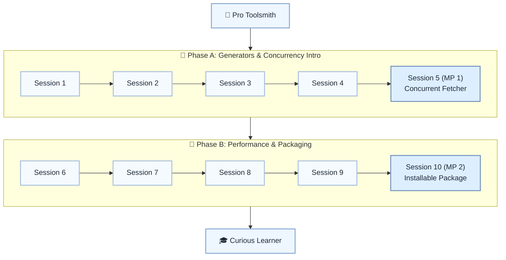

# 🚀 Level 12: Pro Toolsmith → Curious Learner — Advanced Features & Packaging

## Explore advanced Python features and packaging; Stage 2 capstone

> **Stage:** Part 2 — Professional Python Development (Levels 7–12) · **Program:** [Python Software Engineering Journey](../../01_Python-Fundamentals-MasterPlan.md)
>
> 1. **Level:** Pro Toolsmith → Curious Learner
> 1. **Format:** 2 phases × (4 sessions + 1 mini project) = 10 sessions total
> 1. **Outcome:** 2 Mini Projects: concurrent/async mini tool and installable capstone package
> 1. **Core guided time:** ~5 hours core guided instruction (+ MPs)

## Powered by ShyvnTech & Swamy's Tech Skills Academy

> **Transformation Focus:** Understand when advanced features help and how to package and share your work.

### Level 12 status (three axes)

| Axis | Status |
| --- | --- |
| **Curriculum** | Draft — level plan aligned to master plan; session docs pending |
| **Delivery** | Not started (meetup schedule TBD) |
| **Repository** | Planned — `_Plan.md` scaffold; session docs and practice code pending |

📌 *Bridge:* **Stage 2 portfolio checkpoint:** MP2 installable package showcases Levels 1–12 skills.

---

## 🎯 **Level 12 Learning Path (Pro Toolsmith → Curious Learner)**

| Phase | Session | Topic | Duration | Type | Curriculum | Delivery |
| ----- | ------- | ----- | -------- | ---- | ---------- | -------- |
| A | 1 | When to Reach for Advanced Features (Trade-offs & Pitfalls) | 30 min | 📚 Knowledge | Draft | Pending |
| A | 2 | Generators, Iterators & Lazy Evaluation (Beyond for Loops) | 30 min | 📚 Knowledge | Draft | Pending |
| A | 3 | Concurrency Basics: threading vs multiprocessing | 30 min | 📚 Knowledge | Draft | Pending |
| A | 4 | Asyncio Intro: async/await and Event Loops (Conceptual) | 30 min | 📚 Knowledge | Draft | Pending |
| A | 5 (MP 1) | Mini Project 1: Simple Concurrent / Async Fetcher or Worker *(after Session 4)* | 30 min | 🛠️ Project | Draft | Pending |
| B | 6 | Measuring Performance with timeit and cProfile | 30 min | 📚 Knowledge | Draft | Pending |
| B | 7 | Practical Optimization: Hot Spots, Caching & Small Refactors | 30 min | 📚 Knowledge | Draft | Pending |
| B | 8 | Packaging & Distribution: pyproject.toml, Wheels & venv Basics | 30 min | 📚 Knowledge | Draft | Pending |
| B | 9 | Sharing Your Work: Publishing, Docs, and Next-Step Roadmaps | 30 min | 📚 Knowledge | Draft | Pending |
| B | 10 (MP 2) | Mini Project 2: Installable Capstone Package / CLI Tool *(after Session 9)* | 30 min | 🛠️ Project | Draft | Pending |

---

## 🗺️ **Visual Roadmap**

---

## 📅 **Phase A: Phase A: Generators & Concurrency Intro**

### ✅ Session 1: When to Reach for Advanced Features (Trade-offs & Pitfalls) *(Draft · delivery: Pending)*

* Core concepts for When to Reach for Advanced Features (Trade-offs & Pitfalls) (see master plan).

🧪 *Practice / deliverable*: `src/L12/S1/` — planned  
📖 *Documentation*: planned `docs/sessions/L12/S1.md`

---

### ✅ Session 2: Generators, Iterators & Lazy Evaluation (Beyond for Loops) *(Draft · delivery: Pending)*

* Core concepts for Generators, Iterators & Lazy Evaluation (Beyond for Loops) (see master plan).

🧪 *Practice / deliverable*: `src/L12/S2/` — planned  
📖 *Documentation*: planned `docs/sessions/L12/S2.md`

---

### ✅ Session 3: Concurrency Basics: threading vs multiprocessing *(Draft · delivery: Pending)*

* Core concepts for Concurrency Basics: threading vs multiprocessing (see master plan).

🧪 *Practice / deliverable*: `src/L12/S3/` — planned  
📖 *Documentation*: planned `docs/sessions/L12/S3.md`

---

### ✅ Session 4: Asyncio Intro: async/await and Event Loops (Conceptual) *(Draft · delivery: Pending)*

* Core concepts for Asyncio Intro: async/await and Event Loops (Conceptual) (see master plan).

🧪 *Practice / deliverable*: `src/L12/S4/` — planned  
📖 *Documentation*: planned `docs/sessions/L12/S4.md`

---

### 🚀 Mini Project 5 (MP 1): Simple Concurrent / Async Fetcher or Worker *(Draft · delivery: Pending)*

* Deliverable aligned to Mini Project 1: Simple Concurrent / Async Fetcher or Worker (see master plan).

🧪 *Practice / deliverable*: `src/L12/S5/` — planned  
📖 *Documentation*: planned `docs/sessions/L12/S5 (MP 1).md`

---

## 📅 **Phase B: Phase B: Performance & Packaging**

### ✅ Session 6: Measuring Performance with timeit and cProfile *(Draft · delivery: Pending)*

* Core concepts for Measuring Performance with timeit and cProfile (see master plan).

🧪 *Practice / deliverable*: `src/L12/S6/` — planned  
📖 *Documentation*: planned `docs/sessions/L12/S6.md`

---

### ✅ Session 7: Practical Optimization: Hot Spots, Caching & Small Refactors *(Draft · delivery: Pending)*

* Core concepts for Practical Optimization: Hot Spots, Caching & Small Refactors (see master plan).

🧪 *Practice / deliverable*: `src/L12/S7/` — planned  
📖 *Documentation*: planned `docs/sessions/L12/S7.md`

---

### ✅ Session 8: Packaging & Distribution: pyproject.toml, Wheels & venv Basics *(Draft · delivery: Pending)*

* Core concepts for Packaging & Distribution: pyproject.toml, Wheels & venv Basics (see master plan).

🧪 *Practice / deliverable*: `src/L12/S8/` — planned  
📖 *Documentation*: planned `docs/sessions/L12/S8.md`

---

### ✅ Session 9: Sharing Your Work: Publishing, Docs, and Next-Step Roadmaps *(Draft · delivery: Pending)*

* Core concepts for Sharing Your Work: Publishing, Docs, and Next-Step Roadmaps (see master plan).

🧪 *Practice / deliverable*: `src/L12/S9/` — planned  
📖 *Documentation*: planned `docs/sessions/L12/S9.md`

---

### 🚀 Mini Project 10 (MP 2): Installable Capstone Package / CLI Tool *(Draft · delivery: Pending)*

* Deliverable aligned to Mini Project 2: Installable Capstone Package / CLI Tool (see master plan).

🧪 *Practice / deliverable*: `src/L12/S10/` — planned  
📖 *Documentation*: planned `docs/sessions/L12/S10 (MP 2).md`

---

## 🎓 **Level 12 Learning Outcomes**

* Complete Level 12 session outcomes and both mini projects
* Apply concepts from the master plan with original examples
* Be ready for Level 13

### Exit criteria (before next level)

* Explain generators vs regular functions
* Explain threading vs multiprocessing conceptually
* Create a simple installable package with pyproject.toml
* Measure performance with timeit and find a bottleneck

### Reflection (Level 12)

* What surprised me at this level?
* What was hardest — and what habit will I keep?
* What would I redesign in my mini project?
* What could I explain to a peer in five minutes?
* What one ADR would I write for MP1 or MP2?

---

## 📊 **Assessment Criteria**

* **Phase A:** generators/concurrency → MP1 worker
* **Phase B:** packaging → MP2 installable tool

---

## 🎓 **Next Steps & Resources**

* Production relational databases (Level 13)

✨ Happy Coding! 🐍
