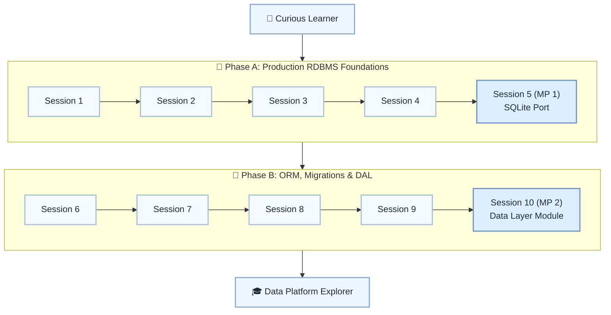

# 🗄️ Level 13: Curious Learner → Data Platform Explorer — Production Relational Databases

## Connect Python to production-grade relational databases

> **Stage:** Part 3 — Python Systems Engineering (Levels 13–18) · **Program:** [Python Software Engineering Journey](../../01_Python-Fundamentals-MasterPlan.md)
>
> 1. **Level:** Curious Learner → Data Platform Explorer
> 1. **Format:** 2 phases × (4 sessions + 1 mini project) = 10 sessions total
> 1. **Outcome:** 2 Mini Projects: SQLite port and reusable data access layer
> 1. **Core guided time:** ~5 hours core guided instruction + ~6–10 h guided labs (setup, ORM, migrations)

## Powered by ShyvnTech & Swamy's Tech Skills Academy

> **Transformation Focus:** Work with PostgreSQL/SQL Server, SQLAlchemy, migrations, and a reusable DAL.

### Level 13 status (three axes)

| Axis | Status |
| --- | --- |
| **Curriculum** | Draft — level plan aligned to master plan; session docs pending |
| **Delivery** | Not started (meetup schedule TBD) |
| **Repository** | Planned — `_Plan.md` scaffold; session docs and practice code pending |

📌 *Bridge:* Port Level 6 SQLite apps; stretch: full migration automation optional.

---

## 🎯 **Level 13 Learning Path (Curious Learner → Data Platform Explorer)**

| Phase | Session | Topic | Duration | Type | Curriculum | Delivery |
| ----- | ------- | ----- | -------- | ---- | ---------- | -------- |
| A | 1 | SQL Server & PostgreSQL Overview: Architecture, Tools & Local Setup | 30 min | 📚 Knowledge | Draft | Pending |
| A | 2 | Connecting from Python: Drivers, Connection Strings & Parameterized Queries | 30 min | 📚 Knowledge | Draft | Pending |
| A | 3 | Schemas, Keys & Constraints in Production Databases | 30 min | 📚 Knowledge | Draft | Pending |
| A | 4 | Indexes & Query Performance 101 (Execution Plans at a Glance) | 30 min | 📚 Knowledge | Draft | Pending |
| A | 5 (MP 1) | Mini Project 1: Port a SQLite App to PostgreSQL or SQL Server *(after Session 4)* | 30–45 min | 🛠️ Project | Draft | Pending |
| B | 6 | Working with SQLAlchemy (Core + Simple ORM Models) | 30 min | 📚 Knowledge | Draft | Pending |
| B | 7 | Environments & Migrations: Dev/Test/Prod, Alembic-Style Migration Basics | 30 min | 📚 Knowledge | Draft | Pending |
| B | 8 | Multi-Database Support & Vendor Differences | 30 min | 📚 Knowledge | Draft | Pending |
| B | 9 | Designing a Reusable Data Access Layer for a Small App | 30 min | 📚 Knowledge | Draft | Pending |
| B | 10 (MP 2) | Mini Project 2: Production-Style Data Layer Library / Module *(after Session 9)* | 30–45 min | 🛠️ Project | Draft | Pending |

---

## 🗺️ **Visual Roadmap**

---

## 📅 **Phase A: Phase A: Production RDBMS Foundations**

### ✅ Session 1: SQL Server & PostgreSQL Overview: Architecture, Tools & Local Setup *(Draft · delivery: Pending)*

* Core concepts for SQL Server & PostgreSQL Overview: Architecture, Tools & Local Setup (see master plan).

🧪 *Practice / deliverable*: `src/L13/S1/` — planned  
📖 *Documentation*: planned `docs/sessions/L13/S1.md`

---

### ✅ Session 2: Connecting from Python: Drivers, Connection Strings & Parameterized Queries *(Draft · delivery: Pending)*

* Core concepts for Connecting from Python: Drivers, Connection Strings & Parameterized Queries (see master plan).

🧪 *Practice / deliverable*: `src/L13/S2/` — planned  
📖 *Documentation*: planned `docs/sessions/L13/S2.md`

---

### ✅ Session 3: Schemas, Keys & Constraints in Production Databases *(Draft · delivery: Pending)*

* Core concepts for Schemas, Keys & Constraints in Production Databases (see master plan).

🧪 *Practice / deliverable*: `src/L13/S3/` — planned  
📖 *Documentation*: planned `docs/sessions/L13/S3.md`

---

### ✅ Session 4: Indexes & Query Performance 101 (Execution Plans at a Glance) *(Draft · delivery: Pending)*

* Core concepts for Indexes & Query Performance 101 (Execution Plans at a Glance) (see master plan).

🧪 *Practice / deliverable*: `src/L13/S4/` — planned  
📖 *Documentation*: planned `docs/sessions/L13/S4.md`

---

### 🚀 Mini Project 5 (MP 1): Port a SQLite App to PostgreSQL or SQL Server *(Draft · delivery: Pending)*

* Deliverable aligned to Mini Project 1: Port a SQLite App to PostgreSQL or SQL Server (see master plan).

🧪 *Practice / deliverable*: `src/L13/S5/` — planned  
📖 *Documentation*: planned `docs/sessions/L13/S5 (MP 1).md`

---

## 📅 **Phase B: Phase B: ORM, Migrations & DAL**

### ✅ Session 6: Working with SQLAlchemy (Core + Simple ORM Models) *(Draft · delivery: Pending)*

* Core concepts for Working with SQLAlchemy (Core + Simple ORM Models) (see master plan).

🧪 *Practice / deliverable*: `src/L13/S6/` — planned  
📖 *Documentation*: planned `docs/sessions/L13/S6.md`

---

### ✅ Session 7: Environments & Migrations: Dev/Test/Prod, Alembic-Style Migration Basics *(Draft · delivery: Pending)*

* Core concepts for Environments & Migrations: Dev/Test/Prod, Alembic-Style Migration Basics (see master plan).

🧪 *Practice / deliverable*: `src/L13/S7/` — planned  
📖 *Documentation*: planned `docs/sessions/L13/S7.md`

---

### ✅ Session 8: Multi-Database Support & Vendor Differences *(Draft · delivery: Pending)*

* Core concepts for Multi-Database Support & Vendor Differences (see master plan).

🧪 *Practice / deliverable*: `src/L13/S8/` — planned  
📖 *Documentation*: planned `docs/sessions/L13/S8.md`

---

### ✅ Session 9: Designing a Reusable Data Access Layer for a Small App *(Draft · delivery: Pending)*

* Core concepts for Designing a Reusable Data Access Layer for a Small App (see master plan).

🧪 *Practice / deliverable*: `src/L13/S9/` — planned  
📖 *Documentation*: planned `docs/sessions/L13/S9.md`

---

### 🚀 Mini Project 10 (MP 2): Production-Style Data Layer Library / Module *(Draft · delivery: Pending)*

* Deliverable aligned to Mini Project 2: Production-Style Data Layer Library / Module (see master plan).

🧪 *Practice / deliverable*: `src/L13/S10/` — planned  
📖 *Documentation*: planned `docs/sessions/L13/S10 (MP 2).md`

---

## 🎓 **Level 13 Learning Outcomes**

* Complete Level 13 session outcomes and both mini projects
* Apply concepts from the master plan with original examples
* Be ready for Level 14

### Reflection (Level 13)

* What surprised me at this level?
* What was hardest — and what habit will I keep?
* What would I redesign in my mini project?
* What could I explain to a peer in five minutes?
* What one ADR would I write for MP1 or MP2?

---

## 📊 **Assessment Criteria**

* **Phase A:** production DB setup → MP1 port
* **Phase B:** SQLAlchemy + DAL → MP2 module

---

## 🎓 **Next Steps & Resources**

* Document databases and caching (Level 14)

✨ Happy Coding! 🐍
