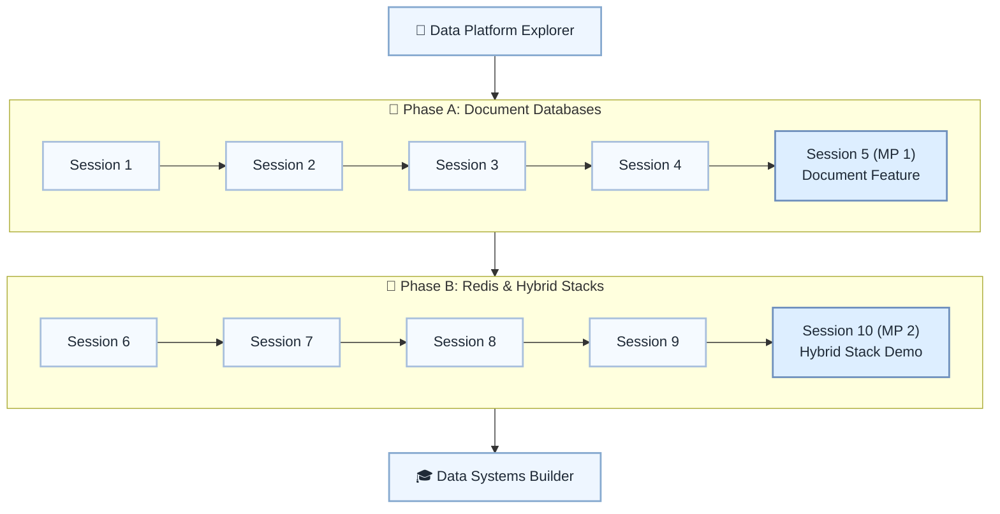

# 🧱 Level 14: Data Platform Explorer → Data Systems Builder — Document DBs & Caching

## Model data for document databases and integrate Redis caching

> **Stage:** Part 3 — Python Systems Engineering (Levels 13–18) · **Program:** [Python Software Engineering Journey](../../01_Python-Fundamentals-MasterPlan.md)
>
> 1. **Level:** Data Platform Explorer → Data Systems Builder
> 1. **Format:** 2 phases × (4 sessions + 1 mini project) = 10 sessions total
> 1. **Outcome:** 2 Mini Projects: document-backed feature and hybrid data stack demo
> 1. **Core guided time:** ~5 hours core guided instruction (+ MPs)

## Powered by ShyvnTech & Swamy's Tech Skills Academy

> **Transformation Focus:** Choose the right store for the job: RDBMS, document DB, and Redis together.

### Level 14 status (three axes)

| Axis | Status |
| --- | --- |
| **Curriculum** | Draft — level plan aligned to master plan; session docs pending |
| **Delivery** | Not started (meetup schedule TBD) |
| **Repository** | Planned — `_Plan.md` scaffold; session docs and practice code pending |

---

## 🎯 **Level 14 Learning Path (Data Platform Explorer → Data Systems Builder)**

| Phase | Session | Topic | Duration | Type | Curriculum | Delivery |
| ----- | ------- | ----- | -------- | ---- | ---------- | -------- |
| A | 1 | Document Databases 101: Collections, Documents & When to Use Them | 30 min | 📚 Knowledge | Draft | Pending |
| A | 2 | Hands-On with a Mongo-Style Document DB from Python (CRUD & Simple Queries) | 30 min | 📚 Knowledge | Draft | Pending |
| A | 3 | Modeling in a Document DB: Embedding vs Referencing & Basic Aggregations | 30 min | 📚 Knowledge | Draft | Pending |
| A | 4 | Indexes, Query Patterns & Evolving Schemas in Document DBs | 30 min | 📚 Knowledge | Draft | Pending |
| A | 5 (MP 1) | Mini Project 1: Document-Backed Feature for an Existing App *(after Session 4)* | 30–45 min | 🛠️ Project | Draft | Pending |
| B | 6 | Redis Fundamentals: Keys, Expiry & Basic Data Structures | 30 min | 📚 Knowledge | Draft | Pending |
| B | 7 | Caching Patterns with Redis: Read-Through, Write-Through & TTL-Based Caches | 30 min | 📚 Knowledge | Draft | Pending |
| B | 8 | Combining Relational + Document DB + Redis in a Small System | 30 min | 📚 Knowledge | Draft | Pending |
| B | 9 | Connection Management, Timeouts & Configuration for Doc DB + Redis | 30 min | 📚 Knowledge | Draft | Pending |
| B | 10 (MP 2) | Mini Project 2: Hybrid Data Stack Demo (RDBMS + Document DB + Redis Cache) *(after Session 9)* | 30–45 min | 🛠️ Project | Draft | Pending |

---

## 🗺️ **Visual Roadmap**

---

## 📅 **Phase A: Phase A: Document Databases**

### ✅ Session 1: Document Databases 101: Collections, Documents & When to Use Them *(Draft · delivery: Pending)*

* Core concepts for Document Databases 101: Collections, Documents & When to Use Them (see master plan).

🧪 *Practice / deliverable*: `src/L14/S1/` — planned  
📖 *Documentation*: planned [S1.md](S1.md)

---

### ✅ Session 2: Hands-On with a Mongo-Style Document DB from Python (CRUD & Simple Queries) *(Draft · delivery: Pending)*

* Core concepts for Hands-On with a Mongo-Style Document DB from Python (CRUD & Simple Queries) (see master plan).

🧪 *Practice / deliverable*: `src/L14/S2/` — planned  
📖 *Documentation*: planned [S2.md](S2.md)

---

### ✅ Session 3: Modeling in a Document DB: Embedding vs Referencing & Basic Aggregations *(Draft · delivery: Pending)*

* Core concepts for Modeling in a Document DB: Embedding vs Referencing & Basic Aggregations (see master plan).

🧪 *Practice / deliverable*: `src/L14/S3/` — planned  
📖 *Documentation*: planned [S3.md](S3.md)

---

### ✅ Session 4: Indexes, Query Patterns & Evolving Schemas in Document DBs *(Draft · delivery: Pending)*

* Core concepts for Indexes, Query Patterns & Evolving Schemas in Document DBs (see master plan).

🧪 *Practice / deliverable*: `src/L14/S4/` — planned  
📖 *Documentation*: planned [S4.md](S4.md)

---

### 🚀 Mini Project 5 (MP 1): Document-Backed Feature for an Existing App *(Draft · delivery: Pending)*

* Deliverable aligned to Mini Project 1: Document-Backed Feature for an Existing App (see master plan).

🧪 *Practice / deliverable*: `src/L14/S5/` — planned  
📖 *Documentation*: planned [S5 (MP 1).md](S5 (MP 1).md)

---

## 📅 **Phase B: Phase B: Redis & Hybrid Stacks**

### ✅ Session 6: Redis Fundamentals: Keys, Expiry & Basic Data Structures *(Draft · delivery: Pending)*

* Core concepts for Redis Fundamentals: Keys, Expiry & Basic Data Structures (see master plan).

🧪 *Practice / deliverable*: `src/L14/S6/` — planned  
📖 *Documentation*: planned [S6.md](S6.md)

---

### ✅ Session 7: Caching Patterns with Redis: Read-Through, Write-Through & TTL-Based Caches *(Draft · delivery: Pending)*

* Core concepts for Caching Patterns with Redis: Read-Through, Write-Through & TTL-Based Caches (see master plan).

🧪 *Practice / deliverable*: `src/L14/S7/` — planned  
📖 *Documentation*: planned [S7.md](S7.md)

---

### ✅ Session 8: Combining Relational + Document DB + Redis in a Small System *(Draft · delivery: Pending)*

* Core concepts for Combining Relational + Document DB + Redis in a Small System (see master plan).

🧪 *Practice / deliverable*: `src/L14/S8/` — planned  
📖 *Documentation*: planned [S8.md](S8.md)

---

### ✅ Session 9: Connection Management, Timeouts & Configuration for Doc DB + Redis *(Draft · delivery: Pending)*

* Core concepts for Connection Management, Timeouts & Configuration for Doc DB + Redis (see master plan).

🧪 *Practice / deliverable*: `src/L14/S9/` — planned  
📖 *Documentation*: planned [S9.md](S9.md)

---

### 🚀 Mini Project 10 (MP 2): Hybrid Data Stack Demo (RDBMS + Document DB + Redis Cache) *(Draft · delivery: Pending)*

* Deliverable aligned to Mini Project 2: Hybrid Data Stack Demo (RDBMS + Document DB + Redis Cache) (see master plan).

🧪 *Practice / deliverable*: `src/L14/S10/` — planned  
📖 *Documentation*: planned [S10 (MP 2).md](S10 (MP 2).md)

---

## 🎓 **Level 14 Learning Outcomes**

* Complete Level 14 session outcomes and both mini projects
* Apply concepts from the master plan with original examples
* Be ready for Level 15

### Reflection (Level 14)

* What surprised me at this level?
* What was hardest — and what habit will I keep?
* What would I redesign in my mini project?
* What could I explain to a peer in five minutes?
* What one ADR would I write for MP1 or MP2?

---

## 📊 **Assessment Criteria**

* **Phase A:** document modeling → MP1 feature
* **Phase B:** Redis cache → MP2 hybrid demo

---

## 🎓 **Next Steps & Resources**

* Messaging, streaming, and deep testing (Level 15)

✨ Happy Coding! 🐍
