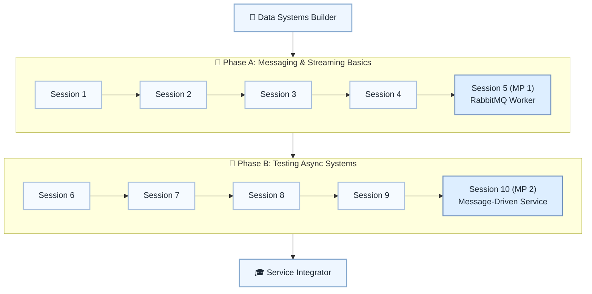

# 📡 Level 15: Data Systems Builder → Service Integrator — Messaging & Deep Testing

## Design message-driven services with RabbitMQ/Kafka and robust tests

> **Stage:** Part 3 — Python Systems Engineering (Levels 13–18) · **Program:** [Python Software Engineering Journey](../../01_Python-Fundamentals-MasterPlan.md)
>
> 1. **Level:** Data Systems Builder → Service Integrator
> 1. **Format:** 2 phases × (4 sessions + 1 mini project) = 10 sessions total
> 1. **Outcome:** 2 Mini Projects: RabbitMQ worker and message-driven service with full test suite
> 1. **Core guided time:** ~5 hours core guided instruction (+ MPs)

## Powered by ShyvnTech & Swamy's Tech Skills Academy

> **Transformation Focus:** Build async flows with unit, integration, and contract tests at boundaries.

### Level 15 status (three axes)

| Axis | Status |
| --- | --- |
| **Curriculum** | Draft — level plan aligned to master plan; session docs pending |
| **Delivery** | Not started (meetup schedule TBD) |
| **Repository** | Planned — `_Plan.md` scaffold; session docs and practice code pending |

---

## 🎯 **Level 15 Learning Path (Data Systems Builder → Service Integrator)**

| Phase | Session | Topic | Duration | Type | Curriculum | Delivery |
| ----- | ------- | ----- | -------- | ---- | ---------- | -------- |
| A | 1 | Messaging & Streaming 101: Queues, Topics & When to Use Them | 30 min | 📚 Knowledge | Draft | Pending |
| A | 2 | RabbitMQ from Python: Producers, Consumers & Acknowledgements | 30 min | 📚 Knowledge | Draft | Pending |
| A | 3 | Kafka from Python: Topics, Partitions & Simple Consumer Groups | 30 min | 📚 Knowledge | Draft | Pending |
| A | 4 | Designing Message-Driven Flows for a Small Application | 30 min | 📚 Knowledge | Draft | Pending |
| A | 5 (MP 1) | Mini Project 1: RabbitMQ-Backed Background Worker for an Existing Feature *(after Session 4)* | 30 min | 🛠️ Project | Draft | Pending |
| B | 6 | Advanced Unit Testing: Mocks, Fakes & Testing Around Message Boundaries | 30 min | 📚 Knowledge | Draft | Pending |
| B | 7 | Integration Testing with Real Infrastructure (DB + RabbitMQ + Kafka via Containers) | 30 min | 📚 Knowledge | Draft | Pending |
| B | 8 | Contract & Schema Testing for Messages (Payload Validation & Backwards Compatibility) | 30 min | 📚 Knowledge | Draft | Pending |
| B | 9 | End-to-End Scenarios & Debugging Asynchronous Flows | 30 min | 📚 Knowledge | Draft | Pending |
| B | 10 (MP 2) | Mini Project 2: Message-Driven Mini Service with Full Test Suite *(after Session 9)* | 30 min | 🛠️ Project | Draft | Pending |

---

## 🗺️ **Visual Roadmap**

---

## 📅 **Phase A: Phase A: Messaging & Streaming Basics**

### ✅ Session 1: Messaging & Streaming 101: Queues, Topics & When to Use Them *(Draft · delivery: Pending)*

* Core concepts for Messaging & Streaming 101: Queues, Topics & When to Use Them (see master plan).

🧪 *Practice / deliverable*: `src/L15/S1/` — planned  
📖 *Documentation*: planned `docs/sessions/L15/S1.md`

---

### ✅ Session 2: RabbitMQ from Python: Producers, Consumers & Acknowledgements *(Draft · delivery: Pending)*

* Core concepts for RabbitMQ from Python: Producers, Consumers & Acknowledgements (see master plan).

🧪 *Practice / deliverable*: `src/L15/S2/` — planned  
📖 *Documentation*: planned `docs/sessions/L15/S2.md`

---

### ✅ Session 3: Kafka from Python: Topics, Partitions & Simple Consumer Groups *(Draft · delivery: Pending)*

* Core concepts for Kafka from Python: Topics, Partitions & Simple Consumer Groups (see master plan).

🧪 *Practice / deliverable*: `src/L15/S3/` — planned  
📖 *Documentation*: planned `docs/sessions/L15/S3.md`

---

### ✅ Session 4: Designing Message-Driven Flows for a Small Application *(Draft · delivery: Pending)*

* Core concepts for Designing Message-Driven Flows for a Small Application (see master plan).

🧪 *Practice / deliverable*: `src/L15/S4/` — planned  
📖 *Documentation*: planned `docs/sessions/L15/S4.md`

---

### 🚀 Mini Project 5 (MP 1): RabbitMQ-Backed Background Worker for an Existing Feature *(Draft · delivery: Pending)*

* Deliverable aligned to Mini Project 1: RabbitMQ-Backed Background Worker for an Existing Feature (see master plan).

🧪 *Practice / deliverable*: `src/L15/S5/` — planned  
📖 *Documentation*: planned `docs/sessions/L15/S5 (MP 1).md`

---

## 📅 **Phase B: Phase B: Testing Async Systems**

### ✅ Session 6: Advanced Unit Testing: Mocks, Fakes & Testing Around Message Boundaries *(Draft · delivery: Pending)*

* Core concepts for Advanced Unit Testing: Mocks, Fakes & Testing Around Message Boundaries (see master plan).

🧪 *Practice / deliverable*: `src/L15/S6/` — planned  
📖 *Documentation*: planned `docs/sessions/L15/S6.md`

---

### ✅ Session 7: Integration Testing with Real Infrastructure (DB + RabbitMQ + Kafka via Containers) *(Draft · delivery: Pending)*

* Core concepts for Integration Testing with Real Infrastructure (DB + RabbitMQ + Kafka via Containers) (see master plan).

🧪 *Practice / deliverable*: `src/L15/S7/` — planned  
📖 *Documentation*: planned `docs/sessions/L15/S7.md`

---

### ✅ Session 8: Contract & Schema Testing for Messages (Payload Validation & Backwards Compatibility) *(Draft · delivery: Pending)*

* Core concepts for Contract & Schema Testing for Messages (Payload Validation & Backwards Compatibility) (see master plan).

🧪 *Practice / deliverable*: `src/L15/S8/` — planned  
📖 *Documentation*: planned `docs/sessions/L15/S8.md`

---

### ✅ Session 9: End-to-End Scenarios & Debugging Asynchronous Flows *(Draft · delivery: Pending)*

* Core concepts for End-to-End Scenarios & Debugging Asynchronous Flows (see master plan).

🧪 *Practice / deliverable*: `src/L15/S9/` — planned  
📖 *Documentation*: planned `docs/sessions/L15/S9.md`

---

### 🚀 Mini Project 10 (MP 2): Message-Driven Mini Service with Full Test Suite *(Draft · delivery: Pending)*

* Deliverable aligned to Mini Project 2: Message-Driven Mini Service with Full Test Suite (see master plan).

🧪 *Practice / deliverable*: `src/L15/S10/` — planned  
📖 *Documentation*: planned `docs/sessions/L15/S10 (MP 2).md`

---

## 🎓 **Level 15 Learning Outcomes**

* Complete Level 15 session outcomes and both mini projects
* Apply concepts from the master plan with original examples
* Be ready for Level 16

### Reflection (Level 15)

* What surprised me at this level?
* What was hardest — and what habit will I keep?
* What would I redesign in my mini project?
* What could I explain to a peer in five minutes?
* What one ADR would I write for MP1 or MP2?

---

## 📊 **Assessment Criteria**

* **Phase A:** RabbitMQ/Kafka basics → MP1 worker
* **Phase B:** integration + contract tests → MP2 service

---

## 🎓 **Next Steps & Resources**

* End-to-end HTTP services (Level 16)

✨ Happy Coding! 🐍
