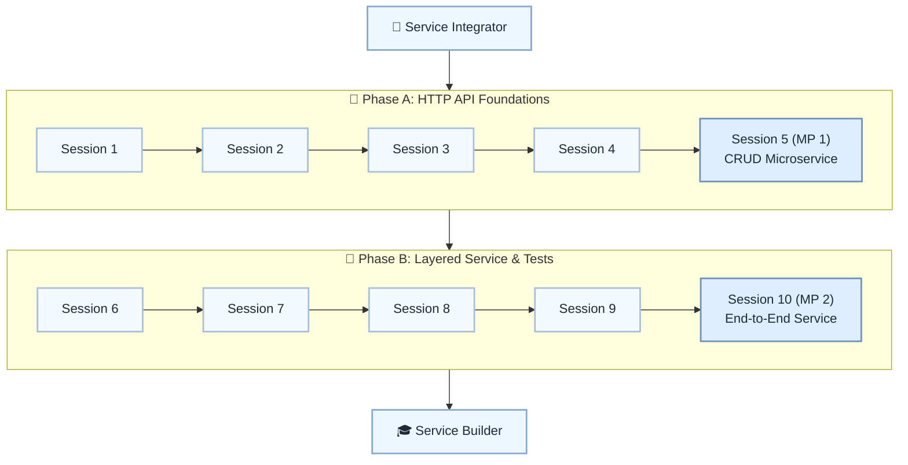

# 🌐 Level 16: Service Integrator → Service Builder — End-to-End Service Foundations

## Build a small HTTP service with layers, tests, and documentation

> **Stage:** Part 3 — Python Systems Engineering (Levels 13–18) · **Program:** [Python Software Engineering Journey](../../01_Python-Fundamentals-MasterPlan.md)
>
> 1. **Level:** Service Integrator → Service Builder
> 1. **Format:** 2 phases × (4 sessions + 1 mini project) = 10 sessions total
> 1. **Outcome:** 2 Mini Projects: CRUD microservice and end-to-end documented service
> 1. **Core guided time:** ~5 hours core guided instruction (+ MPs)

## Powered by ShyvnTech & Swamy's Tech Skills Academy

> **Transformation Focus:** Expose HTTP/JSON APIs backed by real databases with clear layering.

### Level 16 status (three axes)

| Axis | Status |
| --- | --- |
| **Curriculum** | Draft — level plan aligned to master plan; session docs pending |
| **Delivery** | Not started (meetup schedule TBD) |
| **Repository** | Planned — `_Plan.md` scaffold; session docs and practice code pending |

📌 *Bridge:* Integrates data layers from Levels 6, 13, and 14.

---

## 🎯 **Level 16 Learning Path (Service Integrator → Service Builder)**

| Phase | Session | Topic | Duration | Type | Curriculum | Delivery |
| ----- | ------- | ----- | -------- | ---- | ---------- | -------- |
| A | 1 | From Scripts to Services: HTTP, REST & Resource Modeling Basics | 30 min | 📚 Knowledge | Draft | Pending |
| A | 2 | Designing API Endpoints & Request/Response Schemas (JSON Contracts) | 30 min | 📚 Knowledge | Draft | Pending |
| A | 3 | Implementing a Simple CRUD API with a Python Web Framework | 30 min | 📚 Knowledge | Draft | Pending |
| A | 4 | Hooking the API to the Data Layer (DB Repositories + Basic Validation) | 30 min | 📚 Knowledge | Draft | Pending |
| A | 5 (MP 1) | Mini Project 1: CRUD Microservice for an Existing Domain (Tasks/Contacts/etc.) *(after Session 4)* | 30 min | 🛠️ Project | Draft | Pending |
| B | 6 | Service Structure: Routers/Controllers, Services & Repositories | 30 min | 📚 Knowledge | Draft | Pending |
| B | 7 | Basic Security & Guardrails: Simple Auth, Input Validation & Error Handling | 30 min | 📚 Knowledge | Draft | Pending |
| B | 8 | Testing the Service: Unit Tests for Logic, Functional Tests for Endpoints | 30 min | 📚 Knowledge | Draft | Pending |
| B | 9 | Running the Service Locally: Environments, Config & Simple Documentation | 30 min | 📚 Knowledge | Draft | Pending |
| B | 10 (MP 2) | Mini Project 2: End-to-End Service with DB, Tests & API Documentation *(after Session 9)* | 30 min | 🛠️ Project | Draft | Pending |

---

## 🗺️ **Visual Roadmap**

---

## 📅 **Phase A: Phase A: HTTP API Foundations**

### ✅ Session 1: From Scripts to Services: HTTP, REST & Resource Modeling Basics *(Draft · delivery: Pending)*

* Core concepts for From Scripts to Services: HTTP, REST & Resource Modeling Basics (see master plan).

🧪 *Practice / deliverable*: `src/L16/S1/` — planned  
📖 *Documentation*: planned `docs/sessions/L16/S1.md`

---

### ✅ Session 2: Designing API Endpoints & Request/Response Schemas (JSON Contracts) *(Draft · delivery: Pending)*

* Core concepts for Designing API Endpoints & Request/Response Schemas (JSON Contracts) (see master plan).

🧪 *Practice / deliverable*: `src/L16/S2/` — planned  
📖 *Documentation*: planned `docs/sessions/L16/S2.md`

---

### ✅ Session 3: Implementing a Simple CRUD API with a Python Web Framework *(Draft · delivery: Pending)*

* Core concepts for Implementing a Simple CRUD API with a Python Web Framework (see master plan).

🧪 *Practice / deliverable*: `src/L16/S3/` — planned  
📖 *Documentation*: planned `docs/sessions/L16/S3.md`

---

### ✅ Session 4: Hooking the API to the Data Layer (DB Repositories + Basic Validation) *(Draft · delivery: Pending)*

* Core concepts for Hooking the API to the Data Layer (DB Repositories + Basic Validation) (see master plan).

🧪 *Practice / deliverable*: `src/L16/S4/` — planned  
📖 *Documentation*: planned `docs/sessions/L16/S4.md`

---

### 🚀 Mini Project 5 (MP 1): CRUD Microservice for an Existing Domain (Tasks/Contacts/etc.) *(Draft · delivery: Pending)*

* Deliverable aligned to Mini Project 1: CRUD Microservice for an Existing Domain (Tasks/Contacts/etc.) (see master plan).

🧪 *Practice / deliverable*: `src/L16/S5/` — planned  
📖 *Documentation*: planned `docs/sessions/L16/S5 (MP 1).md`

---

## 📅 **Phase B: Phase B: Layered Service & Tests**

### ✅ Session 6: Service Structure: Routers/Controllers, Services & Repositories *(Draft · delivery: Pending)*

* Core concepts for Service Structure: Routers/Controllers, Services & Repositories (see master plan).

🧪 *Practice / deliverable*: `src/L16/S6/` — planned  
📖 *Documentation*: planned `docs/sessions/L16/S6.md`

---

### ✅ Session 7: Basic Security & Guardrails: Simple Auth, Input Validation & Error Handling *(Draft · delivery: Pending)*

* Core concepts for Basic Security & Guardrails: Simple Auth, Input Validation & Error Handling (see master plan).

🧪 *Practice / deliverable*: `src/L16/S7/` — planned  
📖 *Documentation*: planned `docs/sessions/L16/S7.md`

---

### ✅ Session 8: Testing the Service: Unit Tests for Logic, Functional Tests for Endpoints *(Draft · delivery: Pending)*

* Core concepts for Testing the Service: Unit Tests for Logic, Functional Tests for Endpoints (see master plan).

🧪 *Practice / deliverable*: `src/L16/S8/` — planned  
📖 *Documentation*: planned `docs/sessions/L16/S8.md`

---

### ✅ Session 9: Running the Service Locally: Environments, Config & Simple Documentation *(Draft · delivery: Pending)*

* Core concepts for Running the Service Locally: Environments, Config & Simple Documentation (see master plan).

🧪 *Practice / deliverable*: `src/L16/S9/` — planned  
📖 *Documentation*: planned `docs/sessions/L16/S9.md`

---

### 🚀 Mini Project 10 (MP 2): End-to-End Service with DB, Tests & API Documentation *(Draft · delivery: Pending)*

* Deliverable aligned to Mini Project 2: End-to-End Service with DB, Tests & API Documentation (see master plan).

🧪 *Practice / deliverable*: `src/L16/S10/` — planned  
📖 *Documentation*: planned `docs/sessions/L16/S10 (MP 2).md`

---

## 🎓 **Level 16 Learning Outcomes**

* Complete Level 16 session outcomes and both mini projects
* Apply concepts from the master plan with original examples
* Be ready for Level 17

### Reflection (Level 16)

* What surprised me at this level?
* What was hardest — and what habit will I keep?
* What would I redesign in my mini project?
* What could I explain to a peer in five minutes?
* What one ADR would I write for MP1 or MP2?

---

## 📊 **Assessment Criteria**

* **Phase A:** REST + CRUD → MP1 microservice
* **Phase B:** layers + tests → MP2 documented service

---

## 🎓 **Next Steps & Resources**

* Service hardening and observability (Level 17)

✨ Happy Coding! 🐍
