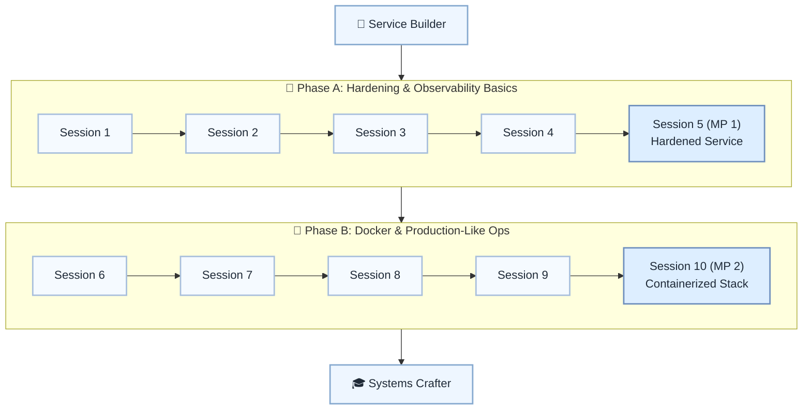

# 🛡️ Level 17: Service Builder → Systems Crafter — Service Hardening & Observability

## Harden services with logging, metrics, config, and Docker-based stacks

> **Stage:** Part 3 — Python Systems Engineering (Levels 13–18) · **Program:** [Python Software Engineering Journey](../../01_Python-Fundamentals-MasterPlan.md)
>
> 1. **Level:** Service Builder → Systems Crafter
> 1. **Format:** 2 phases × (4 sessions + 1 mini project) = 10 sessions total
> 1. **Outcome:** 2 Mini Projects: hardened service and containerized observable mini stack
> 1. **Core guided time:** ~5 hours core guided instruction (+ MPs)

## Powered by ShyvnTech & Swamy's Tech Skills Academy

> **Transformation Focus:** Run Python services with production-like configuration, health checks, and observability.

### Level 17 status (three axes)

| Axis | Status |
| --- | --- |
| **Curriculum** | Draft — level plan aligned to master plan; session docs pending |
| **Delivery** | Not started (meetup schedule TBD) |
| **Repository** | Planned — `_Plan.md` scaffold; session docs and practice code pending |

📌 *Bridge:* Harden the Level 16 service in MP1; compose full stack in MP2.

---

## 🎯 **Level 17 Learning Path (Service Builder → Systems Crafter)**

| Phase | Session | Topic | Duration | Type | Curriculum | Delivery |
| ----- | ------- | ----- | -------- | ---- | ---------- | -------- |
| A | 1 | Service Hardening 101: Failure Modes, Timeouts & Retries | 30 min | 📚 Knowledge | Draft | Pending |
| A | 2 | Structured Logging & Log Levels for Services | 30 min | 📚 Knowledge | Draft | Pending |
| A | 3 | Configuration Management: Env Vars, Config Files & 12-Factor Basics | 30 min | 📚 Knowledge | Draft | Pending |
| A | 4 | Health Checks & Basic Metrics (Counters, Timers, Gauges) | 30 min | 📚 Knowledge | Draft | Pending |
| A | 5 (MP 1) | Mini Project 1: Harden an Existing Service (Timeouts, Logs, Health Endpoint) *(after Session 4)* | 30–45 min | 🛠️ Project | Draft | Pending |
| B | 6 | Docker for Python Services: Writing a Simple, Production-Friendly Dockerfile | 30 min | 📚 Knowledge | Draft | Pending |
| B | 7 | Docker Compose: Running Service + DB/Redis/RabbitMQ Together Locally | 30 min | 📚 Knowledge | Draft | Pending |
| B | 8 | Observability in Containers: Logs, Metrics & Simple Dashboards | 30 min | 📚 Knowledge | Draft | Pending |
| B | 9 | Production-Like Environments: Resource Limits, Readiness & Rollout Basics | 30 min | 📚 Knowledge | Draft | Pending |
| B | 10 (MP 2) | Mini Project 2: Containerized, Observable Mini Stack (Service + Infra) *(after Session 9)* | 30–45 min | 🛠️ Project | Draft | Pending |

---

## 🗺️ **Visual Roadmap**

---

## 📅 **Phase A: Phase A: Hardening & Observability Basics**

### ✅ Session 1: Service Hardening 101: Failure Modes, Timeouts & Retries *(Draft · delivery: Pending)*

* Core concepts for Service Hardening 101: Failure Modes, Timeouts & Retries (see master plan).

🧪 *Practice / deliverable*: `src/L17/S1/` — planned  
📖 *Documentation*: planned [S1.md](S1.md)

---

### ✅ Session 2: Structured Logging & Log Levels for Services *(Draft · delivery: Pending)*

* Core concepts for Structured Logging & Log Levels for Services (see master plan).

🧪 *Practice / deliverable*: `src/L17/S2/` — planned  
📖 *Documentation*: planned [S2.md](S2.md)

---

### ✅ Session 3: Configuration Management: Env Vars, Config Files & 12-Factor Basics *(Draft · delivery: Pending)*

* Core concepts for Configuration Management: Env Vars, Config Files & 12-Factor Basics (see master plan).

🧪 *Practice / deliverable*: `src/L17/S3/` — planned  
📖 *Documentation*: planned [S3.md](S3.md)

---

### ✅ Session 4: Health Checks & Basic Metrics (Counters, Timers, Gauges) *(Draft · delivery: Pending)*

* Core concepts for Health Checks & Basic Metrics (Counters, Timers, Gauges) (see master plan).

🧪 *Practice / deliverable*: `src/L17/S4/` — planned  
📖 *Documentation*: planned [S4.md](S4.md)

---

### 🚀 Mini Project 5 (MP 1): Harden an Existing Service (Timeouts, Logs, Health Endpoint) *(Draft · delivery: Pending)*

* Deliverable aligned to Mini Project 1: Harden an Existing Service (Timeouts, Logs, Health Endpoint) (see master plan).

🧪 *Practice / deliverable*: `src/L17/S5/` — planned  
📖 *Documentation*: planned [S5 (MP 1).md](S5 (MP 1).md)

---

## 📅 **Phase B: Phase B: Docker & Production-Like Ops**

### ✅ Session 6: Docker for Python Services: Writing a Simple, Production-Friendly Dockerfile *(Draft · delivery: Pending)*

* Core concepts for Docker for Python Services: Writing a Simple, Production-Friendly Dockerfile (see master plan).

🧪 *Practice / deliverable*: `src/L17/S6/` — planned  
📖 *Documentation*: planned [S6.md](S6.md)

---

### ✅ Session 7: Docker Compose: Running Service + DB/Redis/RabbitMQ Together Locally *(Draft · delivery: Pending)*

* Core concepts for Docker Compose: Running Service + DB/Redis/RabbitMQ Together Locally (see master plan).

🧪 *Practice / deliverable*: `src/L17/S7/` — planned  
📖 *Documentation*: planned [S7.md](S7.md)

---

### ✅ Session 8: Observability in Containers: Logs, Metrics & Simple Dashboards *(Draft · delivery: Pending)*

* Core concepts for Observability in Containers: Logs, Metrics & Simple Dashboards (see master plan).

🧪 *Practice / deliverable*: `src/L17/S8/` — planned  
📖 *Documentation*: planned [S8.md](S8.md)

---

### ✅ Session 9: Production-Like Environments: Resource Limits, Readiness & Rollout Basics *(Draft · delivery: Pending)*

* Core concepts for Production-Like Environments: Resource Limits, Readiness & Rollout Basics (see master plan).

🧪 *Practice / deliverable*: `src/L17/S9/` — planned  
📖 *Documentation*: planned [S9.md](S9.md)

---

### 🚀 Mini Project 10 (MP 2): Containerized, Observable Mini Stack (Service + Infra) *(Draft · delivery: Pending)*

* Deliverable aligned to Mini Project 2: Containerized, Observable Mini Stack (Service + Infra) (see master plan).

🧪 *Practice / deliverable*: `src/L17/S10/` — planned  
📖 *Documentation*: planned [S10 (MP 2).md](S10 (MP 2).md)

---

## 🎓 **Level 17 Learning Outcomes**

* Complete Level 17 session outcomes and both mini projects
* Apply concepts from the master plan with original examples
* Be ready for Level 18

### Reflection (Level 17)

* What surprised me at this level?
* What was hardest — and what habit will I keep?
* What would I redesign in my mini project?
* What could I explain to a peer in five minutes?
* What one ADR would I write for MP1 or MP2?

---

## 📊 **Assessment Criteria**

* **Phase A:** logging/metrics/health → MP1 hardened service
* **Phase B:** Docker Compose → MP2 observable stack

---

## 🎓 **Next Steps & Resources**

* Capstone project and portfolio (Level 18)

✨ Happy Coding! 🐍
