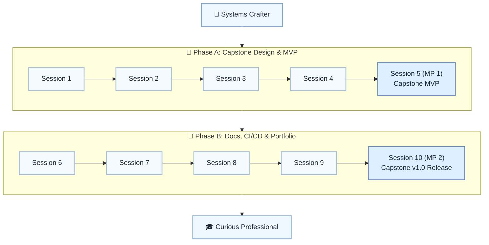

# 🏁 Level 18: Systems Crafter → Curious Professional — Capstone & Portfolio

## Ship a capstone project with docs, tests, CI/CD, and portfolio storytelling

> **Stage:** Part 3 — Python Systems Engineering (Levels 13–18) · **Program:** [Python Software Engineering Journey](../../01_Python-Fundamentals-MasterPlan.md)
>
> 1. **Level:** Systems Crafter → Curious Professional
> 1. **Format:** 2 phases × (4 sessions + 1 mini project) = 10 sessions total
> 1. **Outcome:** 2 Mini Projects: capstone MVP and v1.0 portfolio release
> 1. **Core guided time:** ~5 hours core guided instruction (+ MPs)

## Powered by ShyvnTech & Swamy's Tech Skills Academy

> **Transformation Focus:** Consolidate the full journey into one realistic, documented, tested system.

### Level 18 status (three axes)

| Axis | Status |
| --- | --- |
| **Curriculum** | Draft — level plan aligned to master plan; session docs pending |
| **Delivery** | Not started (meetup schedule TBD) |
| **Repository** | Planned — `_Plan.md` scaffold; session docs and practice code pending |

📌 *Bridge:* **Program capstone:** succeed with ONE end-to-end scenario; stretch goals only after the core works.

---

## 🎯 **Level 18 Learning Path (Systems Crafter → Curious Professional)**

| Phase | Session | Topic | Duration | Type | Curriculum | Delivery |
| ----- | ------- | ----- | -------- | ---- | ---------- | -------- |
| A | 1 | Choosing & Scoping Your Capstone (Domain, Users, Success Criteria) | 30 min | 📚 Knowledge | Draft | Pending |
| A | 2 | Writing a Lightweight Design Doc (Architecture, Data, Interfaces) | 30 min | 📚 Knowledge | Draft | Pending |
| A | 3 | Integrating Building Blocks: DB, Caching, Messaging & HTTP APIs | 30 min | 📚 Knowledge | Draft | Pending |
| A | 4 | Capstone Implementation Sprint 1 (Core Functionality) | 30 min | 📚 Knowledge | Draft | Pending |
| A | 5 (MP 1) | Mini Project 1: Capstone MVP (End-to-End Happy Path Working) *(after Session 4)* | 30 min | 🛠️ Project | Draft | Pending |
| B | 6 | Docs & Developer Experience: README, API Docs & Quickstart | 30 min | 📚 Knowledge | Draft | Pending |
| B | 7 | CI/CD Basics: Automated Tests, Linting & Simple Deployment Pipeline (e.g. GitHub Actions) | 30 min | 📚 Knowledge | Draft | Pending |
| B | 8 | Polishing & Refactoring: Code Quality Pass, Logging/Metrics Review, Packaging for Reuse | 30 min | 📚 Knowledge | Draft | Pending |
| B | 9 | Storytelling & Next Steps: Writing a Portfolio Case Study & Future Learning Roadmap | 30 min | 📚 Knowledge | Draft | Pending |
| B | 10 (MP 2) | Mini Project 2: Capstone v1.0 Release (Tagged, Documented & Showcased in Portfolio) *(after Session 9)* | 30 min | 🛠️ Project | Draft | Pending |

---

## 🗺️ **Visual Roadmap**

---

## 📅 **Phase A: Phase A: Capstone Design & MVP**

### ✅ Session 1: Choosing & Scoping Your Capstone (Domain, Users, Success Criteria) *(Draft · delivery: Pending)*

* Core concepts for Choosing & Scoping Your Capstone (Domain, Users, Success Criteria) (see master plan).

🧪 *Practice / deliverable*: `src/L18/S1/` — planned  
📖 *Documentation*: planned `docs/sessions/L18/S1.md`

---

### ✅ Session 2: Writing a Lightweight Design Doc (Architecture, Data, Interfaces) *(Draft · delivery: Pending)*

* Core concepts for Writing a Lightweight Design Doc (Architecture, Data, Interfaces) (see master plan).

🧪 *Practice / deliverable*: `src/L18/S2/` — planned  
📖 *Documentation*: planned `docs/sessions/L18/S2.md`

---

### ✅ Session 3: Integrating Building Blocks: DB, Caching, Messaging & HTTP APIs *(Draft · delivery: Pending)*

* Core concepts for Integrating Building Blocks: DB, Caching, Messaging & HTTP APIs (see master plan).

🧪 *Practice / deliverable*: `src/L18/S3/` — planned  
📖 *Documentation*: planned `docs/sessions/L18/S3.md`

---

### ✅ Session 4: Capstone Implementation Sprint 1 (Core Functionality) *(Draft · delivery: Pending)*

* Core concepts for Capstone Implementation Sprint 1 (Core Functionality) (see master plan).

🧪 *Practice / deliverable*: `src/L18/S4/` — planned  
📖 *Documentation*: planned `docs/sessions/L18/S4.md`

---

### 🚀 Mini Project 5 (MP 1): Capstone MVP (End-to-End Happy Path Working) *(Draft · delivery: Pending)*

* Deliverable aligned to Mini Project 1: Capstone MVP (End-to-End Happy Path Working) (see master plan).

🧪 *Practice / deliverable*: `src/L18/S5/` — planned  
📖 *Documentation*: planned `docs/sessions/L18/S5 (MP 1).md`

---

## 📅 **Phase B: Phase B: Docs, CI/CD & Portfolio**

### ✅ Session 6: Docs & Developer Experience: README, API Docs & Quickstart *(Draft · delivery: Pending)*

* Core concepts for Docs & Developer Experience: README, API Docs & Quickstart (see master plan).

🧪 *Practice / deliverable*: `src/L18/S6/` — planned  
📖 *Documentation*: planned `docs/sessions/L18/S6.md`

---

### ✅ Session 7: CI/CD Basics: Automated Tests, Linting & Simple Deployment Pipeline (e.g. GitHub Actions) *(Draft · delivery: Pending)*

* Core concepts for CI/CD Basics: Automated Tests, Linting & Simple Deployment Pipeline (e.g. GitHub Actions) (see master plan).

🧪 *Practice / deliverable*: `src/L18/S7/` — planned  
📖 *Documentation*: planned `docs/sessions/L18/S7.md`

---

### ✅ Session 8: Polishing & Refactoring: Code Quality Pass, Logging/Metrics Review, Packaging for Reuse *(Draft · delivery: Pending)*

* Core concepts for Polishing & Refactoring: Code Quality Pass, Logging/Metrics Review, Packaging for Reuse (see master plan).

🧪 *Practice / deliverable*: `src/L18/S8/` — planned  
📖 *Documentation*: planned `docs/sessions/L18/S8.md`

---

### ✅ Session 9: Storytelling & Next Steps: Writing a Portfolio Case Study & Future Learning Roadmap *(Draft · delivery: Pending)*

* Core concepts for Storytelling & Next Steps: Writing a Portfolio Case Study & Future Learning Roadmap (see master plan).

🧪 *Practice / deliverable*: `src/L18/S9/` — planned  
📖 *Documentation*: planned `docs/sessions/L18/S9.md`

---

### 🚀 Mini Project 10 (MP 2): Capstone v1.0 Release (Tagged, Documented & Showcased in Portfolio) *(Draft · delivery: Pending)*

* Deliverable aligned to Mini Project 2: Capstone v1.0 Release (Tagged, Documented & Showcased in Portfolio) (see master plan).

🧪 *Practice / deliverable*: `src/L18/S10/` — planned  
📖 *Documentation*: planned `docs/sessions/L18/S10 (MP 2).md`

---

## 🎓 **Level 18 Learning Outcomes**

* Complete Level 18 session outcomes and both mini projects
* Apply concepts from the master plan with original examples
* Be ready for post-program specialization

### Exit criteria (before next level)

* A working capstone with ONE primary end-to-end flow
* Documentation another developer could use to run the project
* CI/CD pipeline running tests and linting automatically
* A portfolio case study explaining what you built and learned

### Common anti-patterns (Level 18)

* **Scope creep** — building every feature instead of one polished journey
* **Perfection paralysis** — never shipping because the capstone is never done
* **Undocumented stack** — code works but nobody else can run it
* **No tests on the happy path** — the one flow you demo is untested

### Reflection (Level 18)

* What one user journey did I ship end-to-end?
* What would I cut if I had half the time?
* What is in my portfolio case study headline?
* What one ADR best explains my capstone architecture?

### Capstone scope control (critical)

> **Your capstone succeeds if ONE end-to-end scenario works well.**

* ✅ Focus on **one primary user journey** first
* ✅ Make that flow polished, tested, and documented
* ❌ Do not add complexity "just because" (YAGNI)

---

## 📊 **Assessment Criteria**

* **Phase A:** design + MVP → MP1 happy path
* **Phase B:** docs + CI/CD → MP2 v1.0 release

---

## 🎓 **Next Steps & Resources**

* Post-program specialization tracks (optional — see master plan)

✨ Happy Coding! 🐍
