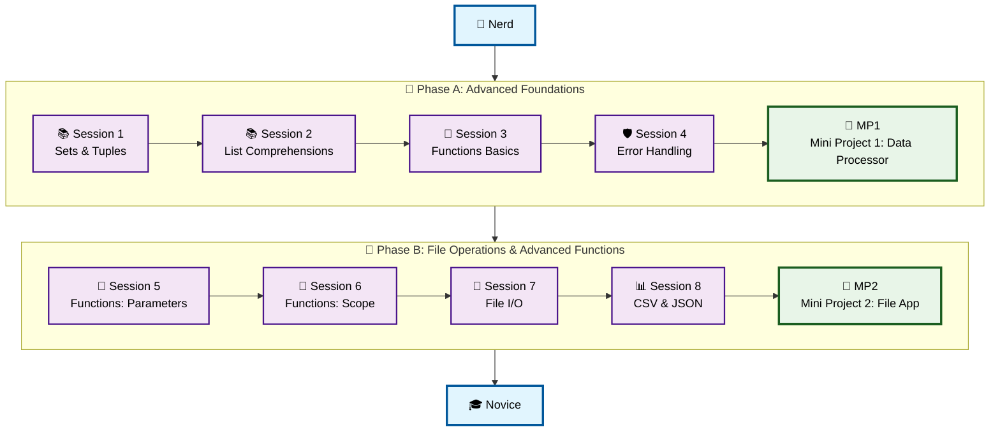

# 🔧 Level 2: Nerd → Novice - Python Fundamentals

## From curious to capable: Building problem-solving skills with functions and files

> 1. **Level:** Nerd → Novice *(building on Level 1, learning functions, error handling, file operations)*
> 1. **Format:** 2 phases × (4 sessions + 1 mini project) = 10 sessions total
> 1. **Outcome:** 2 Mini Projects to develop problem-solving skills  
> 1. **Total Duration:** ~6–7 hours (10 × 30–45 min)

## Powered by ShyvnTech & Swamy's Tech Skills Academy

> **Transformation Focus**: This level transforms you from someone who can write basic code to someone who can solve real problems. You'll learn to write reusable functions, handle errors gracefully, and work with files - essential skills for any Python programmer.

---

## 🎯 **Level 2 Learning Path (Nerd → Novice)**

| Phase | Session | Topic                                                 | Duration  | Type         | Status         |
| ----- | ------- | ----------------------------------------------------- | --------- | ------------ | -------------- |
| A     | 1       | Advanced Data Structures: Sets & Tuples                | 30 min    | 📚 Knowledge | 🔄 Planned 📂  |
| A     | 2       | List Comprehensions                                    | 30 min    | 📚 Knowledge | 🔄 Planned 📂  |
| A     | 3       | Functions: Definition & Basics                         | 30 min    | 📚 Knowledge | 🔄 Planned 📂  |
| A     | 4       | Error Handling: try/except Basics                      | 30 min    | 📚 Knowledge | 🔄 Planned 📂  |
| A     | 🚀 MP1  | Mini Project 1: Data Processor *(after Session 4)*   | 30–45 min | 🛠️ Project  | 🔄 Planned 📂  |
| B     | 5       | Functions: Parameters & Return Values                 | 30 min    | 📚 Knowledge | 🔄 Planned 📂  |
| B     | 6       | Functions: Scope & Code Organization                   | 30 min    | 📚 Knowledge | 🔄 Planned 📂  |
| B     | 7       | File Handling: Reading & Writing Files                | 30 min    | 📚 Knowledge | 🔄 Planned 📂  |
| B     | 8       | File Handling: CSV & JSON Formats                      | 30 min    | 📚 Knowledge | 🔄 Planned 📂  |
| B     | 🚀 MP2  | Mini Project 2: File-Based Application *(after 8)*     | 30–45 min | 🛠️ Project  | 🔄 Planned 📂  |

---

## 🗺️ **Visual Roadmap**

---

## 📅 **Session-by-Session Breakdown**

## 📅 **Phase A: Advanced Foundations + Mini Project 1**

### 🔄 Session 1: Advanced Data Structures: Sets & Tuples

* **Sets**: Unique collections, set operations (union, intersection, difference)
* **Tuples**: Immutable sequences, when to use tuples vs lists
* Creating and manipulating sets and tuples
* Converting between data structures
* Practical use cases: removing duplicates, coordinate pairs, fixed data

🧪 *Mini Practice*: Remove duplicates from a list, store coordinate pairs, work with unique collections.  
📌 *Feeds into Mini Project 1*: Using sets for unique data, tuples for structured data.

---

### 🔄 Session 2: List Comprehensions

* What are list comprehensions and why use them?
* Basic syntax: `[expression for item in iterable]`
* Adding conditions: `[expression for item in iterable if condition]`
* Nested list comprehensions
* When to use comprehensions vs loops
* Performance considerations

🧪 *Mini Practice*: Transform lists elegantly, filter data, create new lists from existing ones.  
📌 *Feeds into Mini Project 1*: Processing and transforming data efficiently.

---

### 🔄 Session 3: Functions: Definition & Basics

* What are functions and why use them?
* Defining functions with `def`
* Calling functions
* Function naming conventions
* Code reusability and DRY principle
* Functions vs scripts

🧪 *Mini Practice*: Create reusable functions for common tasks, organize code into functions.  
📌 *Feeds into Mini Project 1*: Breaking down problems into functions.

---

### 🔄 Session 4: Error Handling: try/except Basics

* Why error handling matters
* `try/except` block syntax
* Handling specific exceptions
* `else` and `finally` clauses
* Common exceptions: `ValueError`, `TypeError`, `FileNotFoundError`
* Graceful error handling vs program crashes

🧪 *Mini Practice*: Handle user input errors, file errors, type conversion errors.  
📌 *Feeds into Mini Project 1*: Making programs robust with error handling.

---

### 🚀 Mini Project 1: Data Processor

**Goal:** Build a data processing application that uses sets, tuples, list comprehensions, and error handling.

**Features:**

* Process a list of data (e.g., student scores, product prices)
* Remove duplicates using sets
* Transform data using list comprehensions
* Store structured data using tuples
* Handle errors gracefully (invalid input, empty data)
* Organize code into reusable functions
* Display processed results

🧪 *Deliverable*: `data_processor.py`

🎯 *Stretch Goals*:

* Add data filtering options
* Calculate statistics (average, min, max)
* Export results to a formatted string

---

## 📅 **Phase B: File Operations & Advanced Functions**

### 🔄 Session 5: Functions: Parameters & Return Values

* Function parameters: positional, keyword, default values
* Multiple parameters and parameter order
* Return values: single and multiple returns
* Returning tuples for multiple values
* `None` and when functions don't return
* Function documentation with docstrings

🧪 *Mini Practice*: Create functions with different parameter types, return multiple values.  
📌 *Feeds into Mini Project 2*: Building functions that work with file data.

---

### 🔄 Session 6: Functions: Scope & Code Organization

* Variable scope: local vs global
* When to use global variables (rarely!)
* Best practices for function design
* Organizing code into multiple functions
* Function composition: calling functions from functions
* Code readability and maintainability

🧪 *Mini Practice*: Organize code into logical functions, understand variable visibility.  
📌 *Feeds into Mini Project 2*: Structuring a file-based application with multiple functions.

---

### 🔄 Session 7: File Handling: Reading & Writing Files

* Opening files: `open()` function
* File modes: `'r'`, `'w'`, `'a'`, `'x'`
* Reading files: `read()`, `readline()`, `readlines()`
* Writing files: `write()`, `writelines()`
* Context managers: `with` statement
* File paths and working with directories
* Error handling for file operations

🧪 *Mini Practice*: Read from text files, write to text files, handle file errors.  
📌 *Feeds into Mini Project 2*: Reading and writing data files.

---

### 🔄 Session 8: File Handling: CSV & JSON Formats

* **CSV files**: Comma-separated values format
* Reading CSV files (manual parsing)
* Writing CSV files
* **JSON files**: JavaScript Object Notation
* Reading JSON files with `json` module
* Writing JSON files
* Data serialization concepts
* When to use CSV vs JSON

🧪 *Mini Practice*: Read/write CSV data, work with JSON configuration files.  
📌 *Feeds into Mini Project 2*: Storing and loading structured data.

---

### 🚀 Mini Project 2: File-Based Application

**Goal:** Build a practical application that reads from and writes to files, handles CSV/JSON data, and uses well-organized functions.

**Features:**

* Read data from a file (CSV or JSON)
* Process the data using functions
* Display results or statistics
* Write processed data to a new file
* Handle file errors gracefully
* Organize code into multiple functions
* Use proper error handling throughout

🧪 *Deliverable*: `file_application.py`

🎯 *Stretch Goals*:

* Support both CSV and JSON formats
* Add data filtering/searching capabilities
* Create a simple menu system
* Export results in multiple formats

---

## 🎓 **Level 2 Learning Outcomes**

By completing Level 2, you will:

* ✅ Work with advanced data structures (sets, tuples) confidently
* ✅ Use list comprehensions to write elegant, efficient code
* ✅ Define and use functions for code reusability
* ✅ Handle errors gracefully with try/except blocks
* ✅ Read from and write to text files
* ✅ Work with CSV and JSON data formats
* ✅ Organize code into reusable, well-structured functions
* ✅ Understand variable scope and best practices
* ✅ Complete 2 mini projects demonstrating problem-solving skills
* ✅ Be ready for **Level 3: Novice → Learner**

---

## 📊 **Assessment Criteria**

* **Phase A**: Can work with sets/tuples, use list comprehensions, define functions, handle errors → Complete Data Processor Project
* **Phase B**: Can use advanced function features, read/write files, work with CSV/JSON → Complete File-Based Application Project

**Mini Project Success Indicators:**

* Data Processor works with sets, tuples, list comprehensions, and handles errors gracefully.
* File-Based Application reads/writes files correctly, handles CSV/JSON, and uses well-organized functions.

---

## 🎓 **Next Steps & Resources**

After Level 2, you're ready to explore:

* Object-Oriented Programming (classes and objects)
* Advanced error handling and custom exceptions
* Working with databases
* Building more complex applications

**Tools Recommended:**

* Python 3.13+
* VS Code with Python extension
* Text editor for working with files
* Sample CSV/JSON files for practice

✨ Happy Coding! 🐍
