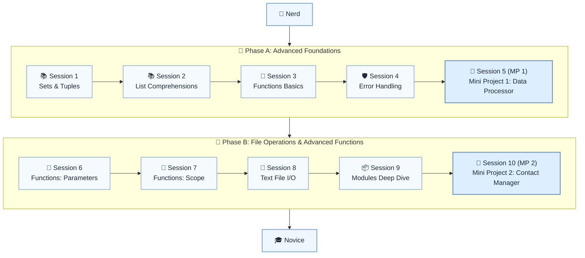

# 🔧 Level 2: Nerd → Novice — Python Fundamentals

## From curious to capable: Building problem-solving skills with functions and files

> **Stage:** Part 1 — Python Fundamentals (Levels 1–6) · **Program:** [Python Software Engineering Journey](../../01_Python-Fundamentals-MasterPlan.md)
>
> 1. **Level:** Nerd → Novice *(building on Level 1 — functions, error handling, file operations)*
> 1. **Format:** 2 phases × (4 sessions + 1 mini project) = 10 sessions total
> 1. **Outcome:** 2 Mini Projects to develop problem-solving skills
> 1. **Core guided time:** ~5–6 hours (8 × 30 min + 2 × 30–45 min MPs)

## Powered by ShyvnTech & Swamy's Tech Skills Academy

> **Transformation Focus:** This level transforms you from someone who can write basic code to someone who can solve real problems. You'll learn to write reusable functions, handle errors gracefully, and work with files — essential skills for any Python programmer.

### Level 2 status (three axes)

| Axis | Status |
| --- | --- |
| **Curriculum** | Validated — session docs + practice files complete |
| **Delivery** | All sessions pending ([meetup table](../../meetup/L2/sessions.md)) |
| **Repository** | Implemented — `src/L2/S1` through `S10` |

---

## 🎯 **Level 2 Learning Path (Nerd → Novice)**

| Phase | Session | Topic                                                 | Duration  | Type         | Curriculum | Delivery  |
| ----- | ------- | ----------------------------------------------------- | --------- | ------------ | ---------- | --------- |
| A     | 1       | Advanced Data Structures: Sets & Tuples                | 30 min    | 📚 Knowledge | Validated  | Pending   |
| A     | 2       | List Comprehensions                                    | 30 min    | 📚 Knowledge | Validated  | Pending   |
| A     | 3       | Functions: Definition & Basics                         | 30 min    | 📚 Knowledge | Validated  | Pending   |
| A     | 4       | Error Handling: try/except Basics                      | 30 min    | 📚 Knowledge | Validated  | Pending   |
| A     | 5 (MP 1) | Mini Project 1: Data Processor *(after Session 4)*   | 30–45 min | 🛠️ Project  | Validated  | Pending   |
| B     | 6       | Functions: Parameters & Return Values                 | 30 min    | 📚 Knowledge | Validated  | Pending   |
| B     | 7       | Functions: Scope & Code Organization                   | 30 min    | 📚 Knowledge | Validated  | Pending   |
| B     | 8       | File Handling: Reading & Writing Text Files           | 30 min    | 📚 Knowledge | Validated  | Pending   |
| B     | 9       | Modules Deep Dive & Code Organization                 | 30 min    | 📚 Knowledge | Validated  | Pending   |
| B     | 10 (MP 2) | Mini Project 2: Contact Manager *(after Session 9)*   | 30–45 min | 🛠️ Project  | Validated  | Pending   |

---

## 🗺️ **Visual Roadmap**


```mermaid
flowchart TB
  A["🎯 Nerd"] --> PhaseA
    PhaseA --> PhaseB
  PhaseB --> K["🎓 Novice"]

  subgraph PhaseA["📘 Phase A: Advanced Foundations"]
    B1["📚 Session 1<br>Sets & Tuples"]
    B2["📚 Session 2<br>List Comprehensions"]
    B3["🔧 Session 3<br>Functions Basics"]
    B4["🛡️ Session 4<br>Error Handling"]
    B5["🚀 Session 5 (MP 1)<br>Mini Project 1: Data Processor"]
        B1 --> B2 --> B3 --> B4 --> B5
    end

  subgraph PhaseB["📘 Phase B: File Operations & Advanced Functions"]
    C1["🔧 Session 6<br>Functions: Parameters"]
    C2["🔧 Session 7<br>Functions: Scope"]
    C3["📁 Session 8<br>Text File I/O"]
    C4["📦 Session 9<br>Modules Deep Dive"]
    C5["🚀 Session 10 (MP 2)<br>Mini Project 2: Contact Manager"]
        C1 --> C2 --> C3 --> C4 --> C5
    end

    classDef startEnd fill:#eef6ff,stroke:#86a9cf,stroke-width:2px,color:#1f2a37
    classDef session fill:#f5faff,stroke:#a8bfdc,stroke-width:2px,color:#1f2a37
    classDef project fill:#ddeeff,stroke:#6f90bd,stroke-width:2px,color:#1f2a37

    class A,K startEnd
    class B1,B2,B3,B4,C1,C2,C3,C4 session
    class B5,C5 project
```

ASCII fallback:

```text
[🎯 Nerd]
    |
    v
[📘 Phase A: Advanced Foundations]
    ├─ [📚 Session 1: Sets & Tuples]
    ├─ [📚 Session 2: List Comprehensions]
    ├─ [🔧 Session 3: Functions Basics]
    ├─ [🛡️ Session 4: Error Handling]
    └─ [🚀 Session 5 (MP 1): Mini Project 1: Data Processor]
    |
    v
[📘 Phase B: File Operations & Advanced Functions]
    ├─ [🔧 Session 6: Functions: Parameters]
    ├─ [🔧 Session 7: Functions: Scope]
    ├─ [📁 Session 8: Text File I/O]
    ├─ [📦 Session 9: Modules Deep Dive]
    └─ [🚀 Session 10 (MP 2): Mini Project 2: Contact Manager]
    |
    v
[🎓 Novice]
```

---

## 📅 **Session-by-Session Breakdown**

## 📅 **Phase A: Advanced Foundations + Mini Project 1**

### ✅ Session 1: Advanced Data Structures: Sets & Tuples *(Validated · delivery: Pending)*

* **Sets**: Unique collections, set operations (union, intersection, difference)
* **Tuples**: Immutable sequences, when to use tuples vs lists
* Creating and manipulating sets and tuples
* Converting between data structures
* Practical use cases: removing duplicates, coordinate pairs, fixed data

🧪 *Practice Files*:  
`src/L2/S1/01_sets_basics.py`, `src/L2/S1/02_tuples_basics.py`, `src/L2/S1/03_conversions.py`

📖 *Documentation*: [S1.md](S1.md)

🧪 *Mini Practice*: Remove duplicates from a list, store coordinate pairs, work with unique collections.  
📌 *Feeds into Mini Project 1*: Using sets for unique data, tuples for structured data.

---

### ✅ Session 2: List Comprehensions *(Validated · delivery: Pending)*

* What are list comprehensions and why use them?
* Basic syntax: `[expression for item in iterable]`
* Adding conditions: `[expression for item in iterable if condition]`
* Nested list comprehensions
* When to use comprehensions vs loops
* Performance considerations

🧪 *Practice Files*:  
`src/L2/S2/01_basic_comprehensions.py`, `src/L2/S2/02_filtered_comprehensions.py`, `src/L2/S2/03_practical_examples.py`

📖 *Documentation*: [S2.md](S2.md)

🧪 *Mini Practice*: Transform lists elegantly, filter data, create new lists from existing ones.  
📌 *Feeds into Mini Project 1*: Processing and transforming data efficiently.

---

### ✅ Session 3: Functions: Definition & Basics *(Validated · delivery: Pending)*

* What are functions and why use them?
* Defining functions with `def`
* Calling functions
* Function naming conventions
* Code reusability and DRY principle
* Functions vs scripts

🧪 *Practice Files*:  
`src/L2/S3/01_basic_functions.py`, `src/L2/S3/02_reusable_functions.py`, `src/L2/S3/03_organized_code.py`

📖 *Documentation*: [S3.md](S3.md)

🧪 *Mini Practice*: Create reusable functions for common tasks, organize code into functions.  
📌 *Feeds into Mini Project 1*: Breaking down problems into functions.

---

### ✅ Session 4: Error Handling: try/except Basics *(Validated · delivery: Pending)*

* Why error handling matters
* `try/except` block syntax
* Handling specific exceptions
* `else` and `finally` clauses
* Common exceptions: `ValueError`, `TypeError`, `FileNotFoundError`
* Graceful error handling vs program crashes

🧪 *Practice Files*:  
`src/L2/S4/01_basic_error_handling.py`, `src/L2/S4/02_multiple_exceptions.py`, `src/L2/S4/03_else_finally.py`

📖 *Documentation*: [S4.md](S4.md)

🧪 *Mini Practice*: Handle user input errors, file errors, type conversion errors.  
📌 *Feeds into Mini Project 1*: Making programs robust with error handling.

---

### 🚀 Mini Project 1: Data Processor *(Validated · delivery: Pending)*

**Goal:** Build a data processing application that uses sets, tuples, list comprehensions, and error handling.

**Features:**

* Process a list of data (e.g., student scores, product prices)
* Remove duplicates using sets
* Transform data using list comprehensions
* Store structured data using tuples
* Handle errors gracefully (invalid input, empty data)
* Organize code into reusable functions
* Display processed results

🧪 *Deliverable*: `src/L2/S5/data_processor.py`  
📖 *Project Guide*: [S5.md](S5.md)

🎯 *Stretch Goals*:

* Add data filtering options
* Calculate statistics (average, min, max)
* Export results to a formatted string

---

## 📅 **Phase B: File Operations & Advanced Functions**

### ✅ Session 6: Functions: Parameters & Return Values *(Validated · delivery: Pending)*

* Function parameters: positional, keyword, default values
* Multiple parameters and parameter order
* Return values: single and multiple returns
* Returning tuples for multiple values
* `None` and when functions don't return
* Function documentation with docstrings

🧪 *Practice Files*:  
`src/L2/S6/01_basic_parameters.py`, `src/L2/S6/02_parameter_types.py`, `src/L2/S6/03_return_values.py`

📖 *Documentation*: [S6.md](S6.md)

🧪 *Mini Practice*: Create functions with different parameter types, return multiple values.  
📌 *Feeds into Mini Project 2*: Building functions that work with file data.

---

### ✅ Session 7: Functions: Scope & Code Organization *(Validated · delivery: Pending)*

* Variable scope: local vs global
* When to use global variables (rarely!)
* Best practices for function design
* Organizing code into multiple functions
* Function composition: calling functions from functions
* Code readability and maintainability

🧪 *Practice Files*:  
`src/L2/S7/01_local_scope.py`, `src/L2/S7/02_global_scope.py`, `src/L2/S7/03_code_organization.py`

📖 *Documentation*: [S7.md](S7.md)

🧪 *Mini Practice*: Organize code into logical functions, understand variable visibility.  
📌 *Feeds into Mini Project 2*: Structuring a file-based application with multiple functions.

---

### ✅ Session 8: File Handling: Reading & Writing Text Files *(Validated · delivery: Pending)*

* Opening files: `open()` function
* File modes: `'r'`, `'w'`, `'a'`, `'x'`
* Reading files: `read()`, `readline()`, `readlines()`
* Writing files: `write()`, `writelines()`
* Context managers: `with` statement (best practice)
* File paths and working with directories
* Error handling for file operations
* Practical examples: reading configuration, writing logs

🧪 *Practice Files*:  
`src/L2/S8/01_reading_files.py`, `src/L2/S8/02_writing_files.py`, `src/L2/S8/03_file_operations.py`

📖 *Documentation*: [S8.md](S8.md)

🧪 *Mini Practice*: Read from text files, write to text files, handle file errors.  
📌 *Feeds into Mini Project 2*: Reading and writing text data files.

---

### ✅ Session 9: Modules Deep Dive & Code Organization *(Validated · delivery: Pending)*

* Creating your own modules
* `__name__` and `__main__`: Understanding module execution
* Importing from your own modules
* Organizing code into multiple files
* Best practices for module design
* Code organization: when to split into modules
* Combining functions and modules for larger projects

🧪 *Practice Files*:  
`src/L2/S9/01_creating_modules.py`, `src/L2/S9/02_name_main.py`, `src/L2/S9/03_multi_file_project.py`

📖 *Documentation*: [S9.md](S9.md)

🧪 *Mini Practice*: Create a module with utility functions, import and use it.  
📌 *Feeds into Mini Project 2*: Structuring a multi-file application.

---

### 🚀 Mini Project 2: Contact Manager *(Validated · delivery: Pending)*

**Goal:** Build a practical application that reads from and writes to text files, uses well-organized functions, and demonstrates modular code structure.

**Features:**

* Read data from a text file
* Process the data using functions
* Display results or statistics
* Write processed data to a new text file
* Handle file errors gracefully
* Organize code into multiple functions
* (Optional) Split code into a module
* Use proper error handling throughout

🧪 *Deliverable*: `src/L2/S10/contact_manager.py`  
📖 *Project Guide*: [S10.md](S10.md)

📌 *Bridge to Level 3:* Contact Manager is a **refactor target** for L3 MP1 (object-based contact manager), alongside L1 Profile Generator.

🎯 *Stretch Goals*:

* Organize code into a separate module file
* Add data filtering/searching capabilities
* Create a simple menu system
* Support multiple input/output file formats

---

## 🎓 **Level 2 Learning Outcomes**

By completing Level 2, you will:

* ✅ Work with advanced data structures (sets, tuples) confidently
* ✅ Use list comprehensions to write elegant, efficient code
* ✅ Define and use functions for code reusability
* ✅ Handle errors gracefully with try/except blocks
* ✅ Read from and write to text files
* ✅ Organize code into modules
* ✅ Organize code into reusable, well-structured functions
* ✅ Understand variable scope and best practices
* ✅ Complete 2 mini projects demonstrating problem-solving skills
* ✅ Be ready for **Level 3: Novice → Object Thinker**

### Exit criteria (before Level 3)

* ✅ Refactor a 50-line script into 3–5 well-named functions
* ✅ Use `try/except` to handle at least two different error types gracefully
* ✅ Read data from a file, process it, and write results to another file
* ✅ Explain the difference between a function definition and a function call

### Common anti-patterns (Level 2)

* ❌ **God Function** — one function that does everything (200+ lines)
* ❌ **Silent Failures** — using `except: pass` without logging or handling the error
* ❌ **Global Variables Everywhere** — modifying global state from inside functions
* ❌ **No Error Handling** — assuming files always exist and operations always succeed

### Reflection (Level 2)

* Which function refactor made the biggest clarity gain?
* Where did `try/except` save you from a crash?
* What would you change before refactoring Contact Manager into classes (L3)?

---

## 📊 **Assessment Criteria**

* **Phase A**: Can work with sets/tuples, use list comprehensions, define functions, handle errors → Complete Data Processor Project
* **Phase B**: Can use advanced function features, read/write text files, organize code into modules → Complete Contact Manager Project

**Mini Project Success Indicators:**

* Data Processor works with sets, tuples, list comprehensions, and handles errors gracefully.
* Contact Manager reads/writes text files correctly, uses well-organized functions, and demonstrates modular code structure.

---

## 🎓 **Next Steps & Resources**

After Level 2, you're ready to explore:

* Object-Oriented Programming (classes and objects)
* Advanced error handling and custom exceptions
* Working with CSV and JSON file formats (Level 4)
* Working with databases
* Building more complex applications

**Tools Recommended:**

* Python 3.13+
* VS Code with Python extension
* Text editor for working with files
* Sample CSV/JSON files for practice

✨ Happy Coding! 🐍
