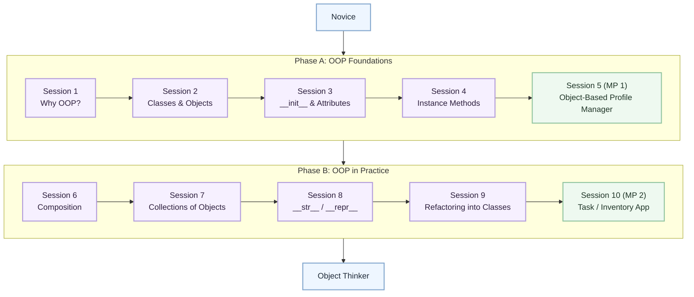

# Level 3: Novice → Object Thinker

## From reusable scripts to small, well-modeled objects

> 1. **Level:** Novice → Object Thinker
> 1. **Format:** 2 phases × (4 sessions + 1 mini project) = 10 sessions total
> 1. **Outcome:** 2 Mini Projects to shift from script thinking to object thinking
> 1. **Total Duration:** ~5–6 hours (8 × 30 min + 2 × 30–45 min)

## Powered by ShyvnTech & Swamy's Tech Skills Academy

> **Transformation Focus**: This level introduces object-oriented thinking in a practical way. The goal is not to memorize OOP jargon. The goal is to model real problems with small classes whose data and behavior belong together.

---

## Level 3 Learning Path (Novice → Object Thinker)

| Phase | Session | Topic | Duration | Type | Status |
| ----- | ------- | ----- | -------- | ---- | ------ |
| A | 1 | Why OOP? From Scripts to Objects | 30 min | Knowledge | Planned |
| A | 2 | Defining Classes & Creating Objects | 30 min | Knowledge | Planned |
| A | 3 | `__init__`, Attributes & Basic Encapsulation | 30 min | Knowledge | Planned |
| A | 4 | Instance Methods & Working with Object State | 30 min | Knowledge | Planned |
| A | 5 (MP 1) | Mini Project 1: Object-Based Profile Manager | 30–45 min | Project | Planned |
| B | 6 | Composing Multiple Objects (Has-a Relationships) | 30 min | Knowledge | Planned |
| B | 7 | Collections of Objects (Lists of Objects) | 30 min | Knowledge | Planned |
| B | 8 | User-Friendly Objects with `__str__` / `__repr__` | 30 min | Knowledge | Planned |
| B | 9 | Refactoring Scripts into Classes (OOP in Practice) | 30 min | Knowledge | Planned |
| B | 10 (MP 2) | Mini Project 2: Object-Oriented Task / Inventory App | 30–45 min | Project | Planned |

---

## Visual Roadmap



ASCII fallback:

```text
[Novice]
    |
    v
[Phase A: OOP Foundations]
    |- [Session 1: Why OOP?]
    |- [Session 2: Classes & Objects]
    |- [Session 3: __init__ & Attributes]
    |- [Session 4: Instance Methods]
    `- [Session 5 (MP 1): Object-Based Profile Manager]
    |
    v
[Phase B: OOP in Practice]
    |- [Session 6: Composition]
    |- [Session 7: Collections of Objects]
    |- [Session 8: __str__ / __repr__]
    |- [Session 9: Refactoring into Classes]
    `- [Session 10 (MP 2): Task / Inventory App]
    |
    v
[Object Thinker]
```

---

## Session-by-Session Breakdown

## Phase A: OOP Foundations + Mini Project 1

### Session 1: Why OOP? From Scripts to Objects

- Why some problems become easier to understand when data and behavior live together
- Comparing script-driven thinking, dictionary-heavy designs, and simple class-based models
- Recognizing when OOP helps and when a plain function is still enough
- Building a beginner-friendly mental model: an object is a value with state and behavior

Mini practice:
Take a small Level 2 script and identify what could become an object.

Feeds into Mini Project 1:
Choosing the right real-world things to model as objects.

### Session 2: Defining Classes & Creating Objects

- Basic `class` syntax
- Creating instances from a class
- Understanding the difference between a class and an object
- Reading object-creation code without getting lost in new syntax

Mini practice:
Create a simple `Book`, `Task`, or `Student` class and instantiate several objects.

Feeds into Mini Project 1:
Turning profile-like records into class instances.

### Session 3: `__init__`, Attributes & Basic Encapsulation

- Using `__init__` to set up object state
- Choosing meaningful instance attributes
- Updating attributes safely
- Intro-level encapsulation: keep object state coherent and avoid random external mutation habits

Mini practice:
Create objects with starting values and inspect their attributes.

Feeds into Mini Project 1:
Representing a profile as a real object instead of a loose dictionary.

### Session 4: Instance Methods & Working with Object State

- Defining methods that use `self`
- Reading and updating object state through methods
- Distinguishing between data stored on the object and actions the object can perform
- Avoiding the “global data everywhere” style from earlier scripts

Mini practice:
Add methods such as `rename()`, `update_score()`, or `mark_done()` to a small class.

Feeds into Mini Project 1:
Giving profile objects behavior, not just stored values.

### Mini Project 1: Object-Based Profile Manager

Goal:
Build a beginner-friendly profile manager that stores profile information inside one or two small classes instead of plain dictionaries.

Features:

- Create profile objects with clearly named attributes
- Show profile details using methods
- Update selected profile fields through object methods
- Store multiple profile objects inside a list
- Keep the design small and readable

Stretch goals:

- Add a second class for related details such as goals or contact info
- Add a simple search feature over a list of profile objects

---

## Phase B: OOP in Practice + Mini Project 2

### Session 6: Composing Multiple Objects (Has-a Relationships)

- Understanding composition with concrete examples such as `Profile` has a `GoalList` or `TaskBoard` has `Task` objects
- Deciding what belongs inside another object versus what should stay separate
- Keeping relationships simple and readable

Mini practice:
Model one object that contains another object instead of flattening everything into one class.

Feeds into Mini Project 2:
Designing interacting objects rather than one oversized class.

### Session 7: Collections of Objects (Lists of Objects)

- Storing many objects inside lists
- Looping over objects and using their attributes or methods
- Searching, filtering, and updating objects inside collections
- Avoiding confusing mixes of dictionaries and objects in the same design

Mini practice:
Create a list of objects and print a summary for each one.

Feeds into Mini Project 2:
Managing a set of tasks or inventory items as real objects.

### Session 8: User-Friendly Objects with `__str__` / `__repr__`

- Why default object output is hard to read
- Using `__str__` for learner-friendly display
- Using `__repr__` as a lightweight debugging aid
- Choosing clear, compact string representations

Mini practice:
Make an object print as useful information rather than a memory address.

Feeds into Mini Project 2:
Improving display and debugging of object collections.

### Session 9: Refactoring Scripts into Classes (OOP in Practice)

- Identifying script code that is ready to become a class
- Moving grouped state and related functions into a class design
- Preserving behavior while improving structure
- Knowing when to stop refactoring before over-designing

Mini practice:
Take a previous script and refactor one slice of it into a class.

Feeds into Mini Project 2:
Turning a script-style task or inventory manager into an object-oriented design.

### Mini Project 2: Object-Oriented Task / Inventory App

Goal:
Build a small console application where tasks or inventory items are modeled as objects with useful methods and clear relationships.

Features:

- Represent tasks or items as objects
- Store multiple objects in a collection
- Add, update, display, and remove entries
- Use object methods for behavior instead of scattered helper logic
- Print objects in a readable way

Stretch goals:

- Add categories, priorities, or quantities using composition
- Refactor menu logic to keep the UI separate from object behavior

---

## Practice and File Planning

This level is planned but not implemented yet.

Expected future paths:

- Session docs: `docs/sessions/L3/S1.md` through `docs/sessions/L3/S10.md`
- Practice code: `src/L3/S1/` through `src/L3/S10/`

These files are intentionally not linked here yet because the level is still in planning.

---

## Exit Criteria

Before moving to Level 4, a learner should be able to:

- Explain why a small class-based model is clearer than a dictionary-only script for at least one example
- Create objects, inspect their attributes, and call their methods without confusion
- Refactor a small script into 2–3 collaborating classes
- Use `__str__` to make objects print in a human-readable form

---

## Common Anti-Patterns to Avoid

- God Object: one class tries to store everything and do everything
- Anemic Model: classes hold data but all behavior lives somewhere else
- Premature Inheritance: inheritance is introduced before composition and plain classes are understood well
- Classes for Everything: simple logic is forced into classes even when state is unnecessary

---

## Learning Outcome

By the end of Level 3, the learner should be able to say:

"I can model a small problem with classes and objects, keep state and behavior together, and refactor simple scripts into clearer object-oriented designs without overcomplicating them."
