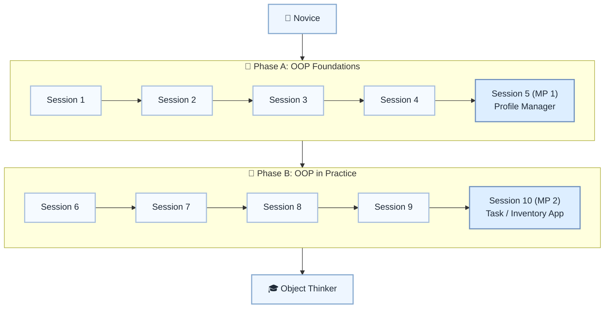

# 🔢 Level 3: Novice → Object Thinker — Core OOP Fundamentals

## From reusable scripts to small, well-modeled objects

> **Stage:** Part 1 — Python Fundamentals (Levels 1–6) · **Program:** [Python Software Engineering Journey](../../01_Python-Fundamentals-MasterPlan.md)
>
> 1. **Level:** Novice → Object Thinker
> 1. **Format:** 2 phases × (4 sessions + 1 mini project) = 10 sessions total
> 1. **Outcome:** 2 Mini Projects to shift from script thinking to object thinking
> 1. **Core guided time:** ~5 hours core guided instruction (+ MPs)

## Powered by ShyvnTech & Swamy's Tech Skills Academy

> **Transformation Focus:** Introduce object-oriented thinking in a practical way — model real problems with small classes whose data and behavior belong together.

### Level 3 status (three axes)

| Axis | Status |
| --- | --- |
| **Curriculum** | Draft — level plan aligned to master plan; session docs pending |
| **Delivery** | All sessions pending ([meetup table](../../meetup/L3/sessions.md)) |
| **Repository** | Scaffolded — `_Plan.md` only; session docs and `src/L3/` pending |

📌 *Bridge:* Refactor **L1 Profile Generator** and **L2 Contact Manager** from dict/file scripts into collaborating classes (MP1 target).

---

## 🎯 **Level 3 Learning Path (Novice → Object Thinker)**

| Phase | Session | Topic | Duration | Type | Curriculum | Delivery |
| ----- | ------- | ----- | -------- | ---- | ---------- | -------- |
| A | 1 | Why OOP? From Scripts to Objects | 30 min | 📚 Knowledge | Draft | Pending |
| A | 2 | Defining Classes & Creating Objects | 30 min | 📚 Knowledge | Draft | Pending |
| A | 3 | __init__, Attributes & Basic Encapsulation | 30 min | 📚 Knowledge | Draft | Pending |
| A | 4 | Instance Methods & Working with Object State | 30 min | 📚 Knowledge | Draft | Pending |
| A | 5 (MP 1) | Mini Project 1: Object-Based Profile Manager *(after Session 4)* | 30–45 min | 🛠️ Project | Draft | Pending |
| B | 6 | Composing Multiple Objects (Has-a Relationships) | 30 min | 📚 Knowledge | Draft | Pending |
| B | 7 | Collections of Objects (Lists of Objects) | 30 min | 📚 Knowledge | Draft | Pending |
| B | 8 | User-Friendly Objects with __str__ / __repr__ | 30 min | 📚 Knowledge | Draft | Pending |
| B | 9 | Refactoring Scripts into Classes (OOP in Practice) | 30 min | 📚 Knowledge | Draft | Pending |
| B | 10 (MP 2) | Mini Project 2: Object-Oriented Task / Inventory App *(after Session 9)* | 30–45 min | 🛠️ Project | Draft | Pending |

---

## 🗺️ **Visual Roadmap**

---

## 📅 **Phase A: Phase A: OOP Foundations**

### ✅ Session 1: Why OOP? From Scripts to Objects *(Draft · delivery: Pending)*

* Why data and behavior together can simplify some problems
* Script vs dictionary vs simple class mental models
* When OOP helps and when a plain function is enough

🧪 *Practice / deliverable*: `src/L3/S1/` — planned  
📖 *Documentation*: planned [S1.md](S1.md)

📌 *Feeds into MP1: choosing real-world things to model as objects*

---

### ✅ Session 2: Defining Classes & Creating Objects *(Draft · delivery: Pending)*

* Basic `class` syntax and creating instances
* Difference between a class and an object

🧪 *Practice / deliverable*: `src/L3/S2/` — planned  
📖 *Documentation*: planned [S2.md](S2.md)

---

### ✅ Session 3: __init__, Attributes & Basic Encapsulation *(Draft · delivery: Pending)*

* Using `__init__` to set up object state
* Meaningful instance attributes and intro-level encapsulation

🧪 *Practice / deliverable*: `src/L3/S3/` — planned  
📖 *Documentation*: planned [S3.md](S3.md)

---

### ✅ Session 4: Instance Methods & Working with Object State *(Draft · delivery: Pending)*

* Methods with `self`; reading and updating state through methods
* Avoiding global data everywhere

🧪 *Practice / deliverable*: `src/L3/S4/` — planned  
📖 *Documentation*: planned [S4.md](S4.md)

---

### 🚀 Mini Project 5 (MP 1): Object-Based Profile Manager *(Draft · delivery: Pending)*

* Create profile objects with named attributes and methods
* Store multiple profile objects in a list
* Refactor L1/L2 profile/contact ideas into classes

🧪 *Practice / deliverable*: `src/L3/S5/` — planned  
📖 *Documentation*: planned [S5 (MP 1).md](S5 (MP 1).md)

📌 *Bridge from L1 Profile Generator and L2 Contact Manager*

---

## 📅 **Phase B: Phase B: OOP in Practice**

### ✅ Session 6: Composing Multiple Objects (Has-a Relationships) *(Draft · delivery: Pending)*

* Composition examples: Profile has GoalList; TaskBoard has Tasks
* What belongs inside another object vs stays separate

🧪 *Practice / deliverable*: `src/L3/S6/` — planned  
📖 *Documentation*: planned [S6.md](S6.md)

---

### ✅ Session 7: Collections of Objects *(Draft · delivery: Pending)*

* Lists of objects; loop, filter, and update collections

🧪 *Practice / deliverable*: `src/L3/S7/` — planned  
📖 *Documentation*: planned [S7.md](S7.md)

---

### ✅ Session 8: User-Friendly Objects with __str__ / __repr__ *(Draft · delivery: Pending)*

* Readable `__str__`; lightweight `__repr__` for debugging

🧪 *Practice / deliverable*: `src/L3/S8/` — planned  
📖 *Documentation*: planned [S8.md](S8.md)

---

### ✅ Session 9: Refactoring Scripts into Classes *(Draft · delivery: Pending)*

* Move grouped state and functions into a class design
* Stop before over-designing

🧪 *Practice / deliverable*: `src/L3/S9/` — planned  
📖 *Documentation*: planned [S9.md](S9.md)

---

### 🚀 Mini Project 10 (MP 2): Object-Oriented Task / Inventory App *(Draft · delivery: Pending)*

* Model tasks or inventory items as objects with methods
* Add, update, display, and remove entries via object behavior

🧪 *Practice / deliverable*: `src/L3/S10/` — planned  
📖 *Documentation*: planned [S10 (MP 2).md](S10 (MP 2).md)

---

## 🎓 **Level 3 Learning Outcomes**

* Explain why a small class-based model can be clearer than a dictionary-only script
* Create objects, inspect attributes, and call methods without confusion
* Refactor a small script into 2–3 collaborating classes
* Use `__str__` to make objects print in a human-readable form
* Say: *I can model a small problem with classes and keep state and behavior together.*

### Exit criteria (before next level)

* Refactor a dictionary-based script (e.g., contact manager) into 2–3 collaborating classes
* Explain why a specific attribute belongs on one class and not another
* Create objects, call their methods, and access attributes without errors
* Use `__str__` to make objects print in a human-readable format

### Common anti-patterns (Level 3)

* **God Object** — one class stores everything and does everything
* **Anemic Model** — classes hold data but all behavior lives elsewhere
* **Premature Inheritance** — inheritance before composition and plain classes are understood
* **Classes for Everything** — simple logic forced into classes when state is unnecessary

### Reflection (Level 3)

* When did a class feel clearer than a dictionary for the same data?
* What attribute placement decision was hardest?
* How would you explain `__init__` to a peer using your MP1 project?

---

## 📊 **Assessment Criteria**

* **Phase A:** Can explain when classes help, define classes, and build MP1 profile manager
* **Phase B:** Can compose objects, refactor scripts, and complete MP2 task/inventory app

---

## 🎓 **Next Steps & Resources**

* OOP design and clean code (Level 4)
* Unit tests for classes (Level 4)
* Refactoring habits and code review (Level 4)

✨ Happy Coding! 🐍
