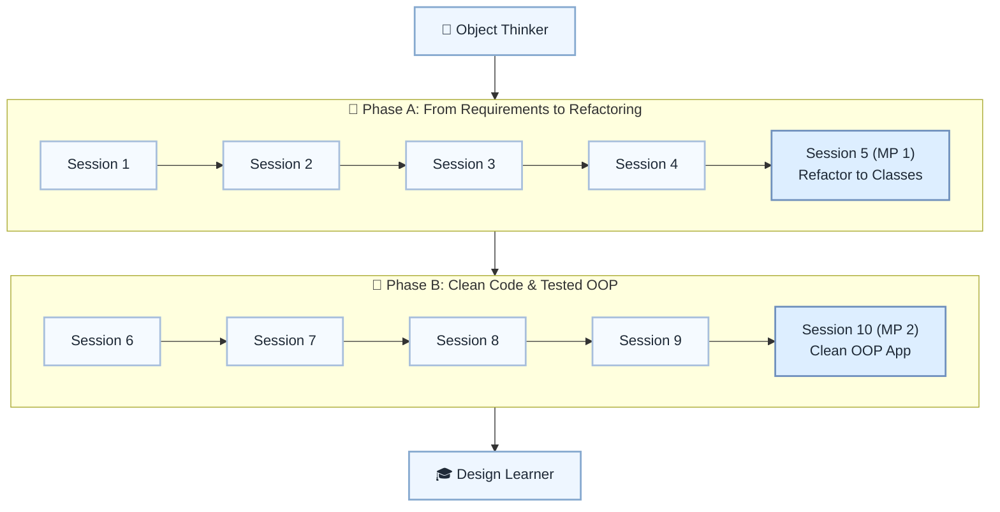

# 🏗️ Level 4: Object Thinker → Design Learner — OOP Design & Clean Code Intro

## Turn basic OOP into good small designs and clean-code thinking

> **Stage:** Part 1 — Python Fundamentals (Levels 1–6) · **Program:** [Python Software Engineering Journey](../../01_Python-Fundamentals-MasterPlan.md)
>
> 1. **Level:** Object Thinker → Design Learner
> 1. **Format:** 2 phases × (4 sessions + 1 mini project) = 10 sessions total
> 1. **Outcome:** 2 Mini Projects applying design, refactoring, and first unit tests
> 1. **Core guided time:** ~5 hours core guided instruction (+ MPs)

## Powered by ShyvnTech & Swamy's Tech Skills Academy

> **Transformation Focus:** Move from working classes to intentional design, refactoring, and testable OOP.

### Level 4 status (three axes)

| Axis | Status |
| --- | --- |
| **Curriculum** | Draft — level plan aligned to master plan; session docs pending |
| **Delivery** | All sessions pending ([meetup table](../../meetup/L4/sessions.md)) |
| **Repository** | Planned — `_Plan.md` scaffold; session docs and practice code pending |

📌 *Bridge:* Refactor a Level 2/3 script (data processor or profile manager) in MP1.

---

## 🎯 **Level 4 Learning Path (Object Thinker → Design Learner)**

| Phase | Session | Topic | Duration | Type | Curriculum | Delivery |
| ----- | ------- | ----- | -------- | ---- | ---------- | -------- |
| A | 1 | From Requirements to Classes (Thinking in Models) | 30 min | 📚 Knowledge | Draft | Pending |
| A | 2 | Designing Responsibilities & Avoiding God Classes | 30 min | 📚 Knowledge | Draft | Pending |
| A | 3 | Improving Class Interfaces (KISS for Methods & Classes) | 30 min | 📚 Knowledge | Draft | Pending |
| A | 4 | Intro to Refactoring: Making Existing Code Cleaner | 30 min | 📚 Knowledge | Draft | Pending |
| A | 5 (MP 1) | Mini Project 1: Refactor a Script into a Class Design *(after Session 4)* | 30 min | 🛠️ Project | Draft | Pending |
| B | 6 | Clean Code Principles: KISS, DRY, YAGNI (Applied) | 30 min | 📚 Knowledge | Draft | Pending |
| B | 7 | Reading & Reviewing Code: Finding Smells in OOP Code | 30 min | 📚 Knowledge | Draft | Pending |
| B | 8 | Intro Unit Tests for Classes (Arrange–Act–Assert) | 30 min | 📚 Knowledge | Draft | Pending |
| B | 9 | Organizing a Small OOP Project (Modules & Packages) | 30 min | 📚 Knowledge | Draft | Pending |
| B | 10 (MP 2) | Mini Project 2: Clean, Tested OOP Console Application *(after Session 9)* | 30 min | 🛠️ Project | Draft | Pending |

---

## 🗺️ **Visual Roadmap**

---

## 📅 **Phase A: Phase A: From Requirements to Refactoring**

### ✅ Session 1: From Requirements to Classes (Thinking in Models) *(Draft · delivery: Pending)*

* Core concepts for From Requirements to Classes (Thinking in Models) (see master plan).

🧪 *Practice / deliverable*: `src/L4/S1/` — planned  
📖 *Documentation*: planned `docs/sessions/L4/S1.md`

---

### ✅ Session 2: Designing Responsibilities & Avoiding God Classes *(Draft · delivery: Pending)*

* Core concepts for Designing Responsibilities & Avoiding God Classes (see master plan).

🧪 *Practice / deliverable*: `src/L4/S2/` — planned  
📖 *Documentation*: planned `docs/sessions/L4/S2.md`

---

### ✅ Session 3: Improving Class Interfaces (KISS for Methods & Classes) *(Draft · delivery: Pending)*

* Core concepts for Improving Class Interfaces (KISS for Methods & Classes) (see master plan).

🧪 *Practice / deliverable*: `src/L4/S3/` — planned  
📖 *Documentation*: planned `docs/sessions/L4/S3.md`

---

### ✅ Session 4: Intro to Refactoring: Making Existing Code Cleaner *(Draft · delivery: Pending)*

* Core concepts for Intro to Refactoring: Making Existing Code Cleaner (see master plan).

🧪 *Practice / deliverable*: `src/L4/S4/` — planned  
📖 *Documentation*: planned `docs/sessions/L4/S4.md`

---

### 🚀 Mini Project 5 (MP 1): Refactor a Script into a Class Design *(Draft · delivery: Pending)*

* Deliverable aligned to Mini Project 1: Refactor a Script into a Class Design (see master plan).

🧪 *Practice / deliverable*: `src/L4/S5/` — planned  
📖 *Documentation*: planned `docs/sessions/L4/S5 (MP 1).md`

---

## 📅 **Phase B: Phase B: Clean Code & Tested OOP**

### ✅ Session 6: Clean Code Principles: KISS, DRY, YAGNI (Applied) *(Draft · delivery: Pending)*

* Core concepts for Clean Code Principles: KISS, DRY, YAGNI (Applied) (see master plan).

🧪 *Practice / deliverable*: `src/L4/S6/` — planned  
📖 *Documentation*: planned `docs/sessions/L4/S6.md`

---

### ✅ Session 7: Reading & Reviewing Code: Finding Smells in OOP Code *(Draft · delivery: Pending)*

* Core concepts for Reading & Reviewing Code: Finding Smells in OOP Code (see master plan).

🧪 *Practice / deliverable*: `src/L4/S7/` — planned  
📖 *Documentation*: planned `docs/sessions/L4/S7.md`

---

### ✅ Session 8: Intro Unit Tests for Classes (Arrange–Act–Assert) *(Draft · delivery: Pending)*

* Core concepts for Intro Unit Tests for Classes (Arrange–Act–Assert) (see master plan).

🧪 *Practice / deliverable*: `src/L4/S8/` — planned  
📖 *Documentation*: planned `docs/sessions/L4/S8.md`

---

### ✅ Session 9: Organizing a Small OOP Project (Modules & Packages) *(Draft · delivery: Pending)*

* Core concepts for Organizing a Small OOP Project (Modules & Packages) (see master plan).

🧪 *Practice / deliverable*: `src/L4/S9/` — planned  
📖 *Documentation*: planned `docs/sessions/L4/S9.md`

---

### 🚀 Mini Project 10 (MP 2): Clean, Tested OOP Console Application *(Draft · delivery: Pending)*

* Deliverable aligned to Mini Project 2: Clean, Tested OOP Console Application (see master plan).

🧪 *Practice / deliverable*: `src/L4/S10/` — planned  
📖 *Documentation*: planned `docs/sessions/L4/S10 (MP 2).md`

---

## 🎓 **Level 4 Learning Outcomes**

* Complete Level 4 session outcomes and both mini projects
* Apply concepts from the master plan with original examples
* Be ready for Level 5

### Exit criteria (before next level)

* Identify a code smell and refactor it
* Write a simple unit test for a class method
* Explain and split a God Object
* Apply KISS, DRY, or YAGNI to real code

### Common anti-patterns (Level 4)

* **Over-Engineering** — patterns before you feel the pain
* **Copy-Paste Refactoring** — duplication instead of shared logic
* **Premature Abstraction** — base classes just in case
* **If-Else Hell** — long chains that need clearer structure

### Reflection (Level 4)

* What surprised me at this level?
* What was hardest — and what habit will I keep?
* What would I redesign in my mini project?
* What could I explain to a peer in five minutes?

---

## 📊 **Assessment Criteria**

* **Phase A:** Requirements → classes → MP1 refactor
* **Phase B:** Clean code, tests, modules → MP2 console app

---

## 🎓 **Next Steps & Resources**

* Files and data formats (Level 5)
* CSV/JSON pipelines (Level 5)

✨ Happy Coding! 🐍
