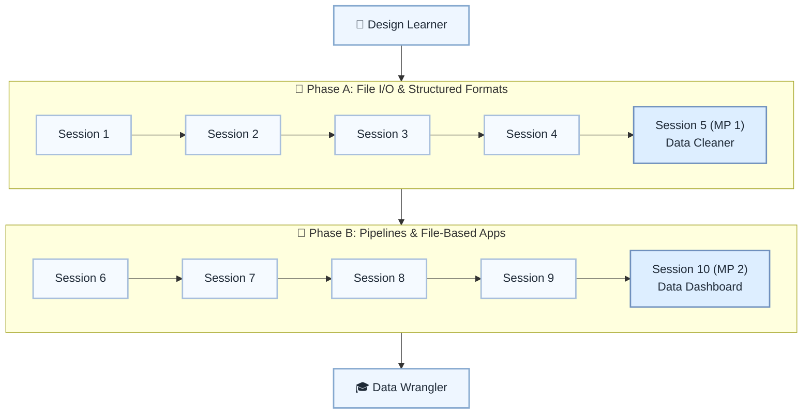

# 📂 Level 5: Design Learner → Data Wrangler — Files & Data Formats

## Become fluent with real-world files and data formats

> **Stage:** Part 1 — Python Fundamentals (Levels 1–6) · **Program:** [Python Software Engineering Journey](../../01_Python-Fundamentals-MasterPlan.md)
>
> 1. **Level:** Design Learner → Data Wrangler
> 1. **Format:** 2 phases × (4 sessions + 1 mini project) = 10 sessions total
> 1. **Outcome:** 2 Mini Projects for CSV/JSON cleaning and file-based reporting
> 1. **Core guided time:** ~5 hours core guided instruction (+ MPs)

## Powered by ShyvnTech & Swamy's Tech Skills Academy

> **Transformation Focus:** Read, clean, transform, and write text, CSV, and JSON data confidently.

### Level 5 status (three axes)

| Axis | Status |
| --- | --- |
| **Curriculum** | Draft — level plan aligned to master plan; session docs pending |
| **Delivery** | All sessions pending ([meetup table](../../meetup/L5/sessions.md)) |
| **Repository** | Planned — `_Plan.md` scaffold; session docs and practice code pending |

📌 *Bridge:* Deepen file I/O from L2 S8; build on clean structure habits from L4.

---

## 🎯 **Level 5 Learning Path (Design Learner → Data Wrangler)**

| Phase | Session | Topic | Duration | Type | Curriculum | Delivery |
| ----- | ------- | ----- | -------- | ---- | ---------- | -------- |
| A | 1 | Reviewing File I/O: Text vs Binary, Paths, Encodings | 30 min | 📚 Knowledge | Draft | Pending |
| A | 2 | CSV Basics: Reading & Writing Tabular Data | 30 min | 📚 Knowledge | Draft | Pending |
| A | 3 | JSON Basics: Nested Structures & Config-Style Data | 30 min | 📚 Knowledge | Draft | Pending |
| A | 4 | From Raw Text to Structured Data (Parsing & Cleaning) | 30 min | 📚 Knowledge | Draft | Pending |
| A | 5 (MP 1) | Mini Project 1: CSV/JSON Data Cleaner & Reporter *(after Session 4)* | 30–45 min | 🛠️ Project | Draft | Pending |
| B | 6 | Building Simple Data Pipelines (Read → Transform → Write) | 30 min | 📚 Knowledge | Draft | Pending |
| B | 7 | Basic Serialization & Settings Files (Configs & States) | 30 min | 📚 Knowledge | Draft | Pending |
| B | 8 | Robust File Handling: Errors, Missing Data & Validation | 30 min | 📚 Knowledge | Draft | Pending |
| B | 9 | End-to-End File-Based Mini App (Putting It All Together) | 30 min | 📚 Knowledge | Draft | Pending |
| B | 10 (MP 2) | Mini Project 2: File-Based Data Dashboard / Reporter *(after Session 9)* | 30–45 min | 🛠️ Project | Draft | Pending |

---

## 🗺️ **Visual Roadmap**

---

## 📅 **Phase A: Phase A: File I/O & Structured Formats**

### ✅ Session 1: Reviewing File I/O: Text vs Binary, Paths, Encodings *(Draft · delivery: Pending)*

* Core concepts for Reviewing File I/O: Text vs Binary, Paths, Encodings (see master plan).

🧪 *Practice / deliverable*: `src/L5/S1/` — planned  
📖 *Documentation*: planned [S1.md](S1.md)

---

### ✅ Session 2: CSV Basics: Reading & Writing Tabular Data *(Draft · delivery: Pending)*

* Core concepts for CSV Basics: Reading & Writing Tabular Data (see master plan).

🧪 *Practice / deliverable*: `src/L5/S2/` — planned  
📖 *Documentation*: planned [S2.md](S2.md)

---

### ✅ Session 3: JSON Basics: Nested Structures & Config-Style Data *(Draft · delivery: Pending)*

* Core concepts for JSON Basics: Nested Structures & Config-Style Data (see master plan).

🧪 *Practice / deliverable*: `src/L5/S3/` — planned  
📖 *Documentation*: planned [S3.md](S3.md)

---

### ✅ Session 4: From Raw Text to Structured Data (Parsing & Cleaning) *(Draft · delivery: Pending)*

* Core concepts for From Raw Text to Structured Data (Parsing & Cleaning) (see master plan).

🧪 *Practice / deliverable*: `src/L5/S4/` — planned  
📖 *Documentation*: planned [S4.md](S4.md)

---

### 🚀 Mini Project 5 (MP 1): CSV/JSON Data Cleaner & Reporter *(Draft · delivery: Pending)*

* Deliverable aligned to Mini Project 1: CSV/JSON Data Cleaner & Reporter (see master plan).

🧪 *Practice / deliverable*: `src/L5/S5/` — planned  
📖 *Documentation*: planned [S5 (MP 1).md](S5 (MP 1).md)

---

## 📅 **Phase B: Phase B: Pipelines & File-Based Apps**

### ✅ Session 6: Building Simple Data Pipelines (Read → Transform → Write) *(Draft · delivery: Pending)*

* Core concepts for Building Simple Data Pipelines (Read → Transform → Write) (see master plan).

🧪 *Practice / deliverable*: `src/L5/S6/` — planned  
📖 *Documentation*: planned [S6.md](S6.md)

---

### ✅ Session 7: Basic Serialization & Settings Files (Configs & States) *(Draft · delivery: Pending)*

* Core concepts for Basic Serialization & Settings Files (Configs & States) (see master plan).

🧪 *Practice / deliverable*: `src/L5/S7/` — planned  
📖 *Documentation*: planned [S7.md](S7.md)

---

### ✅ Session 8: Robust File Handling: Errors, Missing Data & Validation *(Draft · delivery: Pending)*

* Core concepts for Robust File Handling: Errors, Missing Data & Validation (see master plan).

🧪 *Practice / deliverable*: `src/L5/S8/` — planned  
📖 *Documentation*: planned [S8.md](S8.md)

---

### ✅ Session 9: End-to-End File-Based Mini App (Putting It All Together) *(Draft · delivery: Pending)*

* Core concepts for End-to-End File-Based Mini App (Putting It All Together) (see master plan).

🧪 *Practice / deliverable*: `src/L5/S9/` — planned  
📖 *Documentation*: planned [S9.md](S9.md)

---

### 🚀 Mini Project 10 (MP 2): File-Based Data Dashboard / Reporter *(Draft · delivery: Pending)*

* Deliverable aligned to Mini Project 2: File-Based Data Dashboard / Reporter (see master plan).

🧪 *Practice / deliverable*: `src/L5/S10/` — planned  
📖 *Documentation*: planned [S10 (MP 2).md](S10 (MP 2).md)

---

## 🎓 **Level 5 Learning Outcomes**

* Complete Level 5 session outcomes and both mini projects
* Apply concepts from the master plan with original examples
* Be ready for Level 6

### Exit criteria (before next level)

* Read CSV, filter rows, write results
* Parse nested JSON and extract fields
* Handle missing or malformed data gracefully
* Explain when to use CSV vs JSON

### Reflection (Level 5)

* What surprised me at this level?
* What was hardest — and what habit will I keep?
* What would I redesign in my mini project?
* What could I explain to a peer in five minutes?

---

## 📊 **Assessment Criteria**

* **Phase A:** CSV/JSON foundations → MP1 cleaner
* **Phase B:** Pipelines and validation → MP2 dashboard

---

## 🎓 **Next Steps & Resources**

* Relational databases with SQLite (Level 6)

✨ Happy Coding! 🐍
