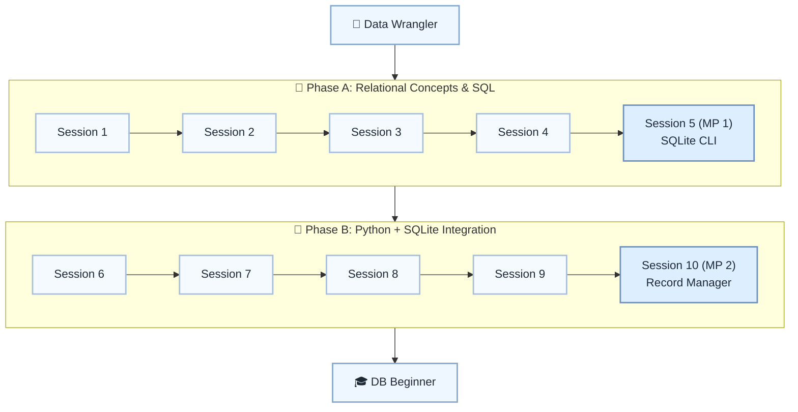

# 🗃️ Level 6: Data Wrangler → DB Beginner — Relational Databases with SQLite

## Build a relational database foundation and connect it to Python

> **Stage:** Part 1 — Python Fundamentals (Levels 1–6) · **Program:** [Python Software Engineering Journey](../../01_Python-Fundamentals-MasterPlan.md)
>
> 1. **Level:** Data Wrangler → DB Beginner
> 1. **Format:** 2 phases × (4 sessions + 1 mini project) = 10 sessions total
> 1. **Outcome:** 2 Mini Projects for SQL CLI and SQLite-backed record management
> 1. **Core guided time:** ~5 hours core guided instruction (+ MPs)

## Powered by ShyvnTech & Swamy's Tech Skills Academy

> **Transformation Focus:** Design simple schemas, write SQL, and connect Python to SQLite reliably.

### Level 6 status (three axes)

| Axis | Status |
| --- | --- |
| **Curriculum** | Draft — level plan aligned to master plan; session docs pending |
| **Delivery** | All sessions pending ([meetup table](../../meetup/L6/sessions.md)) |
| **Repository** | Planned — `_Plan.md` scaffold; session docs and practice code pending |

📌 *Bridge:* Migrate a Level 5 file-based app to SQLite in later sessions.

---

## 🎯 **Level 6 Learning Path (Data Wrangler → DB Beginner)**

| Phase | Session | Topic | Duration | Type | Curriculum | Delivery |
| ----- | ------- | ----- | -------- | ---- | ---------- | -------- |
| A | 1 | Why Databases? From Files to Tables | 30 min | 📚 Knowledge | Draft | Pending |
| A | 2 | Tables, Rows & Keys: Designing a Simple Schema | 30 min | 📚 Knowledge | Draft | Pending |
| A | 3 | SQL Basics: SELECT, INSERT, UPDATE, DELETE | 30 min | 📚 Knowledge | Draft | Pending |
| A | 4 | Filtering & Ordering Data (WHERE, ORDER BY, LIMIT) | 30 min | 📚 Knowledge | Draft | Pending |
| A | 5 (MP 1) | Mini Project 1: CLI over a Single-Table SQLite DB *(after Session 4)* | 30–45 min | 🛠️ Project | Draft | Pending |
| B | 6 | Connecting Python to SQLite (sqlite3 Fundamentals) | 30 min | 📚 Knowledge | Draft | Pending |
| B | 7 | Parameterized Queries & Avoiding SQL Injection | 30 min | 📚 Knowledge | Draft | Pending |
| B | 8 | Simple Joins & Multi-Table Designs (Intro Only) | 30 min | 📚 Knowledge | Draft | Pending |
| B | 9 | Migrating a File-Based App to SQLite (End-to-End) | 30 min | 📚 Knowledge | Draft | Pending |
| B | 10 (MP 2) | Mini Project 2: SQLite-Backed Record Manager *(after Session 9)* | 30–45 min | 🛠️ Project | Draft | Pending |

---

## 🗺️ **Visual Roadmap**

---

## 📅 **Phase A: Phase A: Relational Concepts & SQL**

### ✅ Session 1: Why Databases? From Files to Tables *(Draft · delivery: Pending)*

* Core concepts for Why Databases? From Files to Tables (see master plan).

🧪 *Practice / deliverable*: `src/L6/S1/` — planned  
📖 *Documentation*: planned `docs/sessions/L6/S1.md`

---

### ✅ Session 2: Tables, Rows & Keys: Designing a Simple Schema *(Draft · delivery: Pending)*

* Core concepts for Tables, Rows & Keys: Designing a Simple Schema (see master plan).

🧪 *Practice / deliverable*: `src/L6/S2/` — planned  
📖 *Documentation*: planned `docs/sessions/L6/S2.md`

---

### ✅ Session 3: SQL Basics: SELECT, INSERT, UPDATE, DELETE *(Draft · delivery: Pending)*

* Core concepts for SQL Basics: SELECT, INSERT, UPDATE, DELETE (see master plan).

🧪 *Practice / deliverable*: `src/L6/S3/` — planned  
📖 *Documentation*: planned `docs/sessions/L6/S3.md`

---

### ✅ Session 4: Filtering & Ordering Data (WHERE, ORDER BY, LIMIT) *(Draft · delivery: Pending)*

* Core concepts for Filtering & Ordering Data (WHERE, ORDER BY, LIMIT) (see master plan).

🧪 *Practice / deliverable*: `src/L6/S4/` — planned  
📖 *Documentation*: planned `docs/sessions/L6/S4.md`

---

### 🚀 Mini Project 5 (MP 1): CLI over a Single-Table SQLite DB *(Draft · delivery: Pending)*

* Deliverable aligned to Mini Project 1: CLI over a Single-Table SQLite DB (see master plan).

🧪 *Practice / deliverable*: `src/L6/S5/` — planned  
📖 *Documentation*: planned `docs/sessions/L6/S5 (MP 1).md`

---

## 📅 **Phase B: Phase B: Python + SQLite Integration**

### ✅ Session 6: Connecting Python to SQLite (sqlite3 Fundamentals) *(Draft · delivery: Pending)*

* Core concepts for Connecting Python to SQLite (sqlite3 Fundamentals) (see master plan).

🧪 *Practice / deliverable*: `src/L6/S6/` — planned  
📖 *Documentation*: planned `docs/sessions/L6/S6.md`

---

### ✅ Session 7: Parameterized Queries & Avoiding SQL Injection *(Draft · delivery: Pending)*

* Core concepts for Parameterized Queries & Avoiding SQL Injection (see master plan).

🧪 *Practice / deliverable*: `src/L6/S7/` — planned  
📖 *Documentation*: planned `docs/sessions/L6/S7.md`

---

### ✅ Session 8: Simple Joins & Multi-Table Designs (Intro Only) *(Draft · delivery: Pending)*

* Core concepts for Simple Joins & Multi-Table Designs (Intro Only) (see master plan).

🧪 *Practice / deliverable*: `src/L6/S8/` — planned  
📖 *Documentation*: planned `docs/sessions/L6/S8.md`

---

### ✅ Session 9: Migrating a File-Based App to SQLite (End-to-End) *(Draft · delivery: Pending)*

* Core concepts for Migrating a File-Based App to SQLite (End-to-End) (see master plan).

🧪 *Practice / deliverable*: `src/L6/S9/` — planned  
📖 *Documentation*: planned `docs/sessions/L6/S9.md`

---

### 🚀 Mini Project 10 (MP 2): SQLite-Backed Record Manager *(Draft · delivery: Pending)*

* Deliverable aligned to Mini Project 2: SQLite-Backed Record Manager (see master plan).

🧪 *Practice / deliverable*: `src/L6/S10/` — planned  
📖 *Documentation*: planned `docs/sessions/L6/S10 (MP 2).md`

---

## 🎓 **Level 6 Learning Outcomes**

* Complete Level 6 session outcomes and both mini projects
* Apply concepts from the master plan with original examples
* Be ready for Level 7

### Exit criteria (before next level)

* Design a schema with 2–3 related tables
* Write INSERT, SELECT, UPDATE, DELETE queries
* Use parameterized queries
* Explain database vs JSON/CSV trade-offs

### Reflection (Level 6)

* What surprised me at this level?
* What was hardest — and what habit will I keep?
* What would I redesign in my mini project?
* What could I explain to a peer in five minutes?

---

## 📊 **Assessment Criteria**

* **Phase A:** SQL fundamentals → MP1 single-table CLI
* **Phase B:** sqlite3 + migration → MP2 record manager

---

## 🎓 **Next Steps & Resources**

* NoSQL concepts and HTTP/JSON APIs (Level 7)

✨ Happy Coding! 🐍
