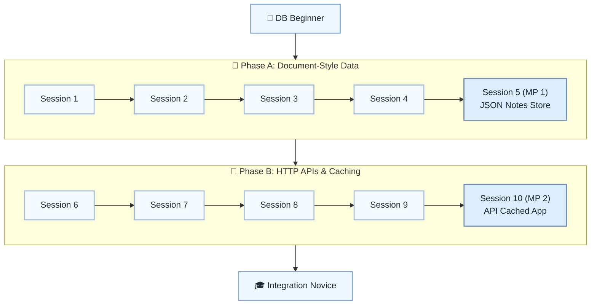

# 🌐 Level 7: DB Beginner → Integration Novice — NoSQL & HTTP/JSON APIs

## Introduce document-style data and HTTP/JSON API integration

> **Stage:** Part 2 — Professional Python Development (Levels 7–12) · **Program:** [Python Software Engineering Journey](../../01_Python-Fundamentals-MasterPlan.md)
>
> 1. **Level:** DB Beginner → Integration Novice
> 1. **Format:** 2 phases × (4 sessions + 1 mini project) = 10 sessions total
> 1. **Outcome:** 2 Mini Projects for JSON document store and API-powered cached app
> 1. **Core guided time:** ~5 hours core guided instruction (+ MPs)

## Powered by ShyvnTech & Swamy's Tech Skills Academy

> **Transformation Focus:** Integrate external JSON APIs with local storage and document-style thinking.

### Level 7 status (three axes)

| Axis | Status |
| --- | --- |
| **Curriculum** | Draft — level plan aligned to master plan; session docs pending |
| **Delivery** | All sessions pending ([meetup table](../../meetup/L7/sessions.md)) |
| **Repository** | Planned — `_Plan.md` scaffold; session docs and practice code pending |

📌 *Bridge:* Prepares for practitioner tooling spiral in Level 8.

---

## 🎯 **Level 7 Learning Path (DB Beginner → Integration Novice)**

| Phase | Session | Topic | Duration | Type | Curriculum | Delivery |
| ----- | ------- | ----- | -------- | ---- | ---------- | -------- |
| A | 1 | From Tables to Documents: NoSQL Concepts with JSON | 30 min | 📚 Knowledge | Draft | Pending |
| A | 2 | Using JSON Files as a Simple Document Store | 30 min | 📚 Knowledge | Draft | Pending |
| A | 3 | Modeling Data in Documents (Keys, Collections, Nested Data) | 30 min | 📚 Knowledge | Draft | Pending |
| A | 4 | Query-Like Operations over In-Memory / File-Based Docs | 30 min | 📚 Knowledge | Draft | Pending |
| A | 5 (MP 1) | Mini Project 1: JSON-Backed NoSQL Notes / Profile Store *(after Session 4)* | 30–45 min | 🛠️ Project | Draft | Pending |
| B | 6 | HTTP & REST Basics: Requests, Responses, Status Codes | 30 min | 📚 Knowledge | Draft | Pending |
| B | 7 | Consuming JSON APIs with requests (GET + Query Params) | 30 min | 📚 Knowledge | Draft | Pending |
| B | 8 | Handling API Errors, Timeouts & Basic Response Validation | 30 min | 📚 Knowledge | Draft | Pending |
| B | 9 | Combining APIs with Local Storage (Caching Remote Data) | 30 min | 📚 Knowledge | Draft | Pending |
| B | 10 (MP 2) | Mini Project 2: API-Powered App with Local JSON Cache *(after Session 9)* | 30–45 min | 🛠️ Project | Draft | Pending |

---

## 🗺️ **Visual Roadmap**

---

## 📅 **Phase A: Phase A: Document-Style Data**

### ✅ Session 1: From Tables to Documents: NoSQL Concepts with JSON *(Draft · delivery: Pending)*

* Core concepts for From Tables to Documents: NoSQL Concepts with JSON (see master plan).

🧪 *Practice / deliverable*: `src/L7/S1/` — planned  
📖 *Documentation*: planned `docs/sessions/L7/S1.md`

---

### ✅ Session 2: Using JSON Files as a Simple Document Store *(Draft · delivery: Pending)*

* Core concepts for Using JSON Files as a Simple Document Store (see master plan).

🧪 *Practice / deliverable*: `src/L7/S2/` — planned  
📖 *Documentation*: planned `docs/sessions/L7/S2.md`

---

### ✅ Session 3: Modeling Data in Documents (Keys, Collections, Nested Data) *(Draft · delivery: Pending)*

* Core concepts for Modeling Data in Documents (Keys, Collections, Nested Data) (see master plan).

🧪 *Practice / deliverable*: `src/L7/S3/` — planned  
📖 *Documentation*: planned `docs/sessions/L7/S3.md`

---

### ✅ Session 4: Query-Like Operations over In-Memory / File-Based Docs *(Draft · delivery: Pending)*

* Core concepts for Query-Like Operations over In-Memory / File-Based Docs (see master plan).

🧪 *Practice / deliverable*: `src/L7/S4/` — planned  
📖 *Documentation*: planned `docs/sessions/L7/S4.md`

---

### 🚀 Mini Project 5 (MP 1): JSON-Backed NoSQL Notes / Profile Store *(Draft · delivery: Pending)*

* Deliverable aligned to Mini Project 1: JSON-Backed NoSQL Notes / Profile Store (see master plan).

🧪 *Practice / deliverable*: `src/L7/S5/` — planned  
📖 *Documentation*: planned `docs/sessions/L7/S5 (MP 1).md`

---

## 📅 **Phase B: Phase B: HTTP APIs & Caching**

### ✅ Session 6: HTTP & REST Basics: Requests, Responses, Status Codes *(Draft · delivery: Pending)*

* Core concepts for HTTP & REST Basics: Requests, Responses, Status Codes (see master plan).

🧪 *Practice / deliverable*: `src/L7/S6/` — planned  
📖 *Documentation*: planned `docs/sessions/L7/S6.md`

---

### ✅ Session 7: Consuming JSON APIs with requests (GET + Query Params) *(Draft · delivery: Pending)*

* Core concepts for Consuming JSON APIs with requests (GET + Query Params) (see master plan).

🧪 *Practice / deliverable*: `src/L7/S7/` — planned  
📖 *Documentation*: planned `docs/sessions/L7/S7.md`

---

### ✅ Session 8: Handling API Errors, Timeouts & Basic Response Validation *(Draft · delivery: Pending)*

* Core concepts for Handling API Errors, Timeouts & Basic Response Validation (see master plan).

🧪 *Practice / deliverable*: `src/L7/S8/` — planned  
📖 *Documentation*: planned `docs/sessions/L7/S8.md`

---

### ✅ Session 9: Combining APIs with Local Storage (Caching Remote Data) *(Draft · delivery: Pending)*

* Core concepts for Combining APIs with Local Storage (Caching Remote Data) (see master plan).

🧪 *Practice / deliverable*: `src/L7/S9/` — planned  
📖 *Documentation*: planned `docs/sessions/L7/S9.md`

---

### 🚀 Mini Project 10 (MP 2): API-Powered App with Local JSON Cache *(Draft · delivery: Pending)*

* Deliverable aligned to Mini Project 2: API-Powered App with Local JSON Cache (see master plan).

🧪 *Practice / deliverable*: `src/L7/S10/` — planned  
📖 *Documentation*: planned `docs/sessions/L7/S10 (MP 2).md`

---

## 🎓 **Level 7 Learning Outcomes**

* Complete Level 7 session outcomes and both mini projects
* Apply concepts from the master plan with original examples
* Be ready for Level 8

### Exit criteria (before next level)

* Explain when JSON documents beat relational tables
* Cache API data locally and discuss invalidation
* Handle API errors gracefully
* Make a GET request and parse JSON

### Reflection (Level 7)

* What surprised me at this level?
* What was hardest — and what habit will I keep?
* What would I redesign in my mini project?
* What could I explain to a peer in five minutes?

---

## 📊 **Assessment Criteria**

* **Phase A:** Document modeling → MP1 JSON store
* **Phase B:** HTTP + cache → MP2 API app

---

## 🎓 **Next Steps & Resources**

* Clean code, Git, CLI tooling, and testing (Level 8)

✨ Happy Coding! 🐍
