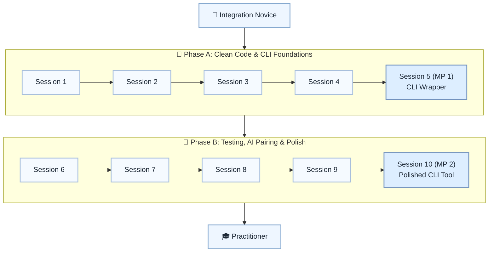

# 🧹 Level 8: Integration Novice → Practitioner — Clean Code & Tooling

## Become a working practitioner with clean code, CLI, Git, and tests

> **Stage:** Part 2 — Professional Python Development (Levels 7–12) · **Program:** [Python Software Engineering Journey](../../01_Python-Fundamentals-MasterPlan.md)
>
> 1. **Level:** Integration Novice → Practitioner
> 1. **Format:** 2 phases × (4 sessions + 1 mini project) = 10 sessions total
> 1. **Outcome:** 2 Mini Projects: CLI wrapper and polished portfolio-ready CLI tool
> 1. **Core guided time:** ~5 hours core guided instruction (+ MPs)

## Powered by ShyvnTech & Swamy's Tech Skills Academy

> **Transformation Focus:** Structure, test, version-control, and polish small Python projects like real tools.

### Level 8 status (three axes)

| Axis | Status |
| --- | --- |
| **Curriculum** | Draft — level plan aligned to master plan; session docs pending |
| **Delivery** | All sessions pending ([meetup table](../../meetup/L8/sessions.md)) |
| **Repository** | Planned — `_Plan.md` scaffold; session docs and practice code pending |

📌 *Bridge:* **Portfolio checkpoint:** MP2 should be a clone-and-run CLI in a Git repo. Spiral reinforcement of pytest/Git/formatting after L4/L7.

---

## 🎯 **Level 8 Learning Path (Integration Novice → Practitioner)**

| Phase | Session | Topic | Duration | Type | Curriculum | Delivery |
| ----- | ------- | ----- | -------- | ---- | ---------- | -------- |
| A | 1 | Practical KISS/DRY/YAGNI on Real Code | 30 min | 📚 Knowledge | Draft | Pending |
| A | 2 | Building User-Friendly CLIs (argparse / click Intro) | 30 min | 📚 Knowledge | Draft | Pending |
| A | 3 | Structuring Projects: Folders, Modules, and Entry Points | 30 min | 📚 Knowledge | Draft | Pending |
| A | 4 | Git Basics: Commits, Branches, and Clean Histories | 30 min | 📚 Knowledge | Draft | Pending |
| A | 5 (MP 1) | Mini Project 1: CLI Wrapper Around an Existing Project *(after Session 4)* | 30–45 min | 🛠️ Project | Draft | Pending |
| B | 6 | Everyday Testing with pytest / unittest (No TDD Dogma) | 30 min | 📚 Knowledge | Draft | Pending |
| B | 7 | AI as Pair Programmer: Prompting for Refactoring & Code Review | 30 min | 📚 Knowledge | Draft | Pending |
| B | 8 | Formatting & Linting (black, isort, flake8 – Concept Intro) | 30 min | 📚 Knowledge | Draft | Pending |
| B | 9 | Polishing a Small Project: From Script to Mini Product | 30 min | 📚 Knowledge | Draft | Pending |
| B | 10 (MP 2) | Mini Project 2: Polished, Tested CLI Tool in Git Repo *(after Session 9)* | 30–45 min | 🛠️ Project | Draft | Pending |

---

## 🗺️ **Visual Roadmap**

---

## 📅 **Phase A: Phase A: Clean Code & CLI Foundations**

### ✅ Session 1: Practical KISS/DRY/YAGNI on Real Code *(Draft · delivery: Pending)*

* Core concepts for Practical KISS/DRY/YAGNI on Real Code (see master plan).

🧪 *Practice / deliverable*: `src/L8/S1/` — planned  
📖 *Documentation*: planned `docs/sessions/L8/S1.md`

---

### ✅ Session 2: Building User-Friendly CLIs (argparse / click Intro) *(Draft · delivery: Pending)*

* Core concepts for Building User-Friendly CLIs (argparse / click Intro) (see master plan).

🧪 *Practice / deliverable*: `src/L8/S2/` — planned  
📖 *Documentation*: planned `docs/sessions/L8/S2.md`

---

### ✅ Session 3: Structuring Projects: Folders, Modules, and Entry Points *(Draft · delivery: Pending)*

* Core concepts for Structuring Projects: Folders, Modules, and Entry Points (see master plan).

🧪 *Practice / deliverable*: `src/L8/S3/` — planned  
📖 *Documentation*: planned `docs/sessions/L8/S3.md`

---

### ✅ Session 4: Git Basics: Commits, Branches, and Clean Histories *(Draft · delivery: Pending)*

* Core concepts for Git Basics: Commits, Branches, and Clean Histories (see master plan).

🧪 *Practice / deliverable*: `src/L8/S4/` — planned  
📖 *Documentation*: planned `docs/sessions/L8/S4.md`

---

### 🚀 Mini Project 5 (MP 1): CLI Wrapper Around an Existing Project *(Draft · delivery: Pending)*

* Deliverable aligned to Mini Project 1: CLI Wrapper Around an Existing Project (see master plan).

🧪 *Practice / deliverable*: `src/L8/S5/` — planned  
📖 *Documentation*: planned `docs/sessions/L8/S5 (MP 1).md`

---

## 📅 **Phase B: Phase B: Testing, AI Pairing & Polish**

### ✅ Session 6: Everyday Testing with pytest / unittest (No TDD Dogma) *(Draft · delivery: Pending)*

* Core concepts for Everyday Testing with pytest / unittest (No TDD Dogma) (see master plan).

🧪 *Practice / deliverable*: `src/L8/S6/` — planned  
📖 *Documentation*: planned `docs/sessions/L8/S6.md`

---

### ✅ Session 7: AI as Pair Programmer: Prompting for Refactoring & Code Review *(Draft · delivery: Pending)*

* Core concepts for AI as Pair Programmer: Prompting for Refactoring & Code Review (see master plan).

🧪 *Practice / deliverable*: `src/L8/S7/` — planned  
📖 *Documentation*: planned `docs/sessions/L8/S7.md`

---

### ✅ Session 8: Formatting & Linting (black, isort, flake8 – Concept Intro) *(Draft · delivery: Pending)*

* Core concepts for Formatting & Linting (black, isort, flake8 – Concept Intro) (see master plan).

🧪 *Practice / deliverable*: `src/L8/S8/` — planned  
📖 *Documentation*: planned `docs/sessions/L8/S8.md`

---

### ✅ Session 9: Polishing a Small Project: From Script to Mini Product *(Draft · delivery: Pending)*

* Core concepts for Polishing a Small Project: From Script to Mini Product (see master plan).

🧪 *Practice / deliverable*: `src/L8/S9/` — planned  
📖 *Documentation*: planned `docs/sessions/L8/S9.md`

---

### 🚀 Mini Project 10 (MP 2): Polished, Tested CLI Tool in Git Repo *(Draft · delivery: Pending)*

* Deliverable aligned to Mini Project 2: Polished, Tested CLI Tool in Git Repo (see master plan).

🧪 *Practice / deliverable*: `src/L8/S10/` — planned  
📖 *Documentation*: planned `docs/sessions/L8/S10 (MP 2).md`

---

## 🎓 **Level 8 Learning Outcomes**

* Complete Level 8 session outcomes and both mini projects
* Apply concepts from the master plan with original examples
* Be ready for Level 9

### Exit criteria (before next level)

* Create a Git repo with meaningful commits
* Write at least 3 pytest tests for real code
* Use AI suggestions critically and verify output
* Run black and flake8 and fix issues

### Common anti-patterns (Level 8)

* **Blind AI Trust** — using AI code without understanding
* **No Version Control** — skipping Git on small projects
* **Tests That Don't Test** — tests that always pass
* **Over-Configuration** — hours tuning tools instead of shipping

### Reflection (Level 8)

* What surprised me at this level?
* What was hardest — and what habit will I keep?
* What would I redesign in my mini project?
* What could I explain to a peer in five minutes?
* What one ADR would I write for MP1 or MP2?

### AI usage guidelines (Level 8)

* ✅ **Use AI for:** explaining code, generating test cases, refactor suggestions, finding bugs
* ✅ **Always:** review AI output critically and verify with tests or examples
* ❌ **Don't:** copy-paste AI code without understanding or skip manual practice

---

## 📊 **Assessment Criteria**

* **Phase A:** CLI + Git → MP1 wrapper
* **Phase B:** Tests + polish → MP2 portfolio CLI

---

## 🎓 **Next Steps & Resources**

* Design patterns and architecture (Level 9)

✨ Happy Coding! 🐍
