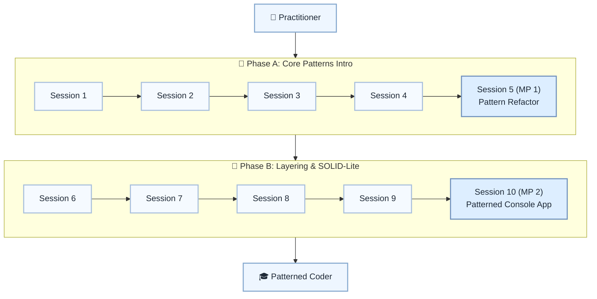

# 🏛️ Level 9: Practitioner → Patterned Coder — Design Patterns & Architecture

## Learn practical design patterns and architectural habits

> **Stage:** Part 2 — Professional Python Development (Levels 7–12) · **Program:** [Python Software Engineering Journey](../../01_Python-Fundamentals-MasterPlan.md)
>
> 1. **Level:** Practitioner → Patterned Coder
> 1. **Format:** 2 phases × (4 sessions + 1 mini project) = 10 sessions total
> 1. **Outcome:** 2 Mini Projects applying patterns and layered console design
> 1. **Core guided time:** ~5 hours core guided instruction (+ MPs)

## Powered by ShyvnTech & Swamy's Tech Skills Academy

> **Transformation Focus:** Apply a small set of patterns and layering where they improve clarity and extension.

### Level 9 status (three axes)

| Axis | Status |
| --- | --- |
| **Curriculum** | Draft — level plan aligned to master plan; session docs pending |
| **Delivery** | All sessions pending ([meetup table](../../meetup/L9/sessions.md)) |
| **Repository** | Planned — `_Plan.md` scaffold; session docs and practice code pending |

---

## 🎯 **Level 9 Learning Path (Practitioner → Patterned Coder)**

| Phase | Session | Topic | Duration | Type | Curriculum | Delivery |
| ----- | ------- | ----- | -------- | ---- | ---------- | -------- |
| A | 1 | Why Patterns? When & When Not to Use Them | 30 min | 📚 Knowledge | Draft | Pending |
| A | 2 | Strategy Pattern: Swappable Behaviours Without if Everywhere | 30 min | 📚 Knowledge | Draft | Pending |
| A | 3 | Factory / Creator Functions: Centralizing Object Creation | 30 min | 📚 Knowledge | Draft | Pending |
| A | 4 | Observer / Pub-Sub (Intro to Event-Driven Thinking) | 30 min | 📚 Knowledge | Draft | Pending |
| A | 5 (MP 1) | Mini Project 1: Refactor to Use One Core Pattern *(after Session 4)* | 30–45 min | 🛠️ Project | Draft | Pending |
| B | 6 | Separation of Concerns & Layering (UI / Logic / Data) | 30 min | 📚 Knowledge | Draft | Pending |
| B | 7 | Decorator vs Inheritance: Extending Behaviour Safely | 30 min | 📚 Knowledge | Draft | Pending |
| B | 8 | SOLID-Lite: SRP & Open/Closed in Small Python Projects | 30 min | 📚 Knowledge | Draft | Pending |
| B | 9 | Putting It Together: A Patterned, Layered Console Application | 30 min | 📚 Knowledge | Draft | Pending |
| B | 10 (MP 2) | Mini Project 2: Patterned Console App / Plugin-Style Tool *(after Session 9)* | 30–45 min | 🛠️ Project | Draft | Pending |

---

## 🗺️ **Visual Roadmap**

---

## 📅 **Phase A: Phase A: Core Patterns Intro**

### ✅ Session 1: Why Patterns? When & When Not to Use Them *(Draft · delivery: Pending)*

* Core concepts for Why Patterns? When & When Not to Use Them (see master plan).

🧪 *Practice / deliverable*: `src/L9/S1/` — planned  
📖 *Documentation*: planned [S1.md](S1.md)

---

### ✅ Session 2: Strategy Pattern: Swappable Behaviours Without if Everywhere *(Draft · delivery: Pending)*

* Core concepts for Strategy Pattern: Swappable Behaviours Without if Everywhere (see master plan).

🧪 *Practice / deliverable*: `src/L9/S2/` — planned  
📖 *Documentation*: planned [S2.md](S2.md)

---

### ✅ Session 3: Factory / Creator Functions: Centralizing Object Creation *(Draft · delivery: Pending)*

* Core concepts for Factory / Creator Functions: Centralizing Object Creation (see master plan).

🧪 *Practice / deliverable*: `src/L9/S3/` — planned  
📖 *Documentation*: planned [S3.md](S3.md)

---

### ✅ Session 4: Observer / Pub-Sub (Intro to Event-Driven Thinking) *(Draft · delivery: Pending)*

* Core concepts for Observer / Pub-Sub (Intro to Event-Driven Thinking) (see master plan).

🧪 *Practice / deliverable*: `src/L9/S4/` — planned  
📖 *Documentation*: planned [S4.md](S4.md)

---

### 🚀 Mini Project 5 (MP 1): Refactor to Use One Core Pattern *(Draft · delivery: Pending)*

* Deliverable aligned to Mini Project 1: Refactor to Use One Core Pattern (see master plan).

🧪 *Practice / deliverable*: `src/L9/S5/` — planned  
📖 *Documentation*: planned [S5 (MP 1).md](S5 (MP 1).md)

---

## 📅 **Phase B: Phase B: Layering & SOLID-Lite**

### ✅ Session 6: Separation of Concerns & Layering (UI / Logic / Data) *(Draft · delivery: Pending)*

* Core concepts for Separation of Concerns & Layering (UI / Logic / Data) (see master plan).

🧪 *Practice / deliverable*: `src/L9/S6/` — planned  
📖 *Documentation*: planned [S6.md](S6.md)

---

### ✅ Session 7: Decorator vs Inheritance: Extending Behaviour Safely *(Draft · delivery: Pending)*

* Core concepts for Decorator vs Inheritance: Extending Behaviour Safely (see master plan).

🧪 *Practice / deliverable*: `src/L9/S7/` — planned  
📖 *Documentation*: planned [S7.md](S7.md)

---

### ✅ Session 8: SOLID-Lite: SRP & Open/Closed in Small Python Projects *(Draft · delivery: Pending)*

* Core concepts for SOLID-Lite: SRP & Open/Closed in Small Python Projects (see master plan).

🧪 *Practice / deliverable*: `src/L9/S8/` — planned  
📖 *Documentation*: planned [S8.md](S8.md)

---

### ✅ Session 9: Putting It Together: A Patterned, Layered Console Application *(Draft · delivery: Pending)*

* Core concepts for Putting It Together: A Patterned, Layered Console Application (see master plan).

🧪 *Practice / deliverable*: `src/L9/S9/` — planned  
📖 *Documentation*: planned [S9.md](S9.md)

---

### 🚀 Mini Project 10 (MP 2): Patterned Console App / Plugin-Style Tool *(Draft · delivery: Pending)*

* Deliverable aligned to Mini Project 2: Patterned Console App / Plugin-Style Tool (see master plan).

🧪 *Practice / deliverable*: `src/L9/S10/` — planned  
📖 *Documentation*: planned [S10 (MP 2).md](S10 (MP 2).md)

---

## 🎓 **Level 9 Learning Outcomes**

* Complete Level 9 session outcomes and both mini projects
* Apply concepts from the master plan with original examples
* Be ready for Level 10

### Exit criteria (before next level)

* Refactor using Strategy, Factory, or Observer where it helps
* Explain when a pattern helps vs adds complexity
* Separate UI from business logic
* Explain the system to a new teammate in 3 minutes

### Common anti-patterns (Level 9)

* **Pattern Overload** — patterns everywhere just because
* **Premature Abstraction** — interfaces before concrete implementations
* **Anemic Domain Model** — logic only in services
* **Tight Coupling** — concrete dependencies everywhere

### Reflection (Level 9)

* What surprised me at this level?
* What was hardest — and what habit will I keep?
* What would I redesign in my mini project?
* What could I explain to a peer in five minutes?
* What one ADR would I write for MP1 or MP2?

### Architecture narrative (Level 9+)

Practice explaining your design:

* Why does each component exist?
* What breaks if we remove it?
* Can you explain the system to a new teammate in 3 minutes?

---

## 📊 **Assessment Criteria**

* **Phase A:** Strategy/Factory/Observer → MP1 refactor
* **Phase B:** Layering + SOLID-lite → MP2 patterned app

---

## 🎓 **Next Steps & Resources**

* Standard library mastery (Level 10)

✨ Happy Coding! 🐍
